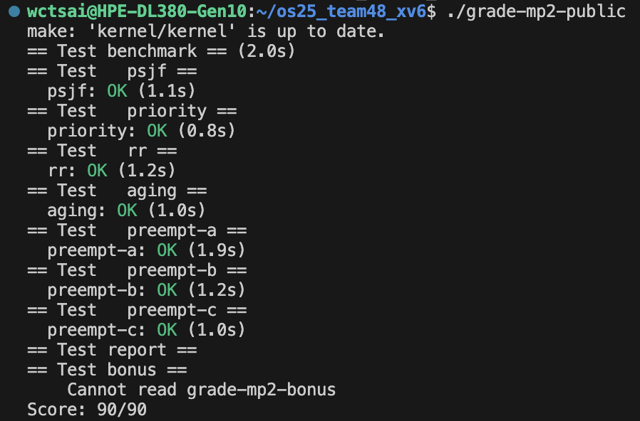

# MP2 report 
  112062527 陳俞靜
  114065501 蔡宛秦

## Table of contents

- [Trace Code](#trace-code)
  - [1. Timer Interrupt Handling and Context Switching](#timer-interrupt-handling-and-context-switching)
  - [2. Mapping xv6 Process States](#mapping-xv6-process-states)
  - [3. Process State Transitions and Queue Interactions](#process-state-transitions-and-queue-interactions)
- [Implementation](#implementation)
  - [1. Proc.c/Proc.h](#1-procc--proch)
  - [2. Mfqs.h : funct-prototypes](#2-mp2-mfqsh-function-prototypes)
  - [3. Mfqs.c : queue-management](#3-mp2-mfqsc-queue-management)
  - [4. Mfqs.c : queue-time-records](#4-mp2-mfqsc-queue-time-records)
  - [5. Aging](#5-mp2-mfqsc-aging-implementation)
- [Test report]()
  - [1. ]()
  - [2. ]()
- [Contributions](#contributions)

## Trace Code
### Timer Interrupt Handling and Context Switching
- CSR （控制暫存器）: 用於管理系統權限、虛擬記憶體和 Trap
     - sstatus：狀態暫存器（S-mode 版）
        > RISC-V 模式(M/S/U mode)
        >  - S-mode	(Supervisor Mode) : RISC-V 採用多級權限模式來隔離軟體並保護kernel，S-mode 屬於中級權限，可以存取所有的記憶體和 I/O，管理虛擬記憶體，並處理來自 U-mode的系統呼叫 (syscall) 和中斷
        >  - M-mode	(Machine Mode) : 最高權限，硬體層級的初始化和底層例外處理，特別是Timer Interrupt。xv6 利用 M-mode 的計時器功能來實現排程器的時間切片。M-mode 程式碼通常是固件或底層函式庫
        >  - U-mode (User Mode) : 最低權限，使用者撰寫的測試程式或 shell 執行在此模式。U-mode 只能存取受限的記憶體和資源
      - sepc : 儲存 trap 前的 PC，回到 user mode 時要從這裡繼續（usertrapret 寫回）
     - stvec : Trap 入口點位址，指定中斷發生時跳去哪（設成 uservec 或 kernelvec）
     - sscratch：暫存暫存器（S-mode），存放 user stack pointer（在 trampoline.S 用）。
     - satp：Page table 根指標，控制虛擬記憶體（切換 user/kernel page table）
     - sie：Interrupt Enable，哪些中斷允許（timer、software、external）
     - sip：Interrupt Pending，哪些中斷正在等待處理（bit1=SSIP），每一個 bit 代表不同類型的中斷是否「掛起」（正在等待被處理）：
       > 0：USIP，使用者模式軟體中斷\
       > 1：SSIP，主管（Supervisor）模式軟體中斷，sip裡的一個位元（bit 1）。\
       > 5：STIP，定時器中斷（Timer interrupt）\
       > 9：SEIP，外部裝置中斷（External interrupt）
     - scause：為什麼 CPU 進入 trap（例如外部中斷、timer、syscall...）
     - SPP（Supervisor Previous Privilege）：決定 sret 之後回到 U 或 S。清成 0 就是回 U。
     - SPIE：S-Previous Interrupt Enable（sie 備份位）sret 之後把 SIE（中斷允許位）恢復為 1 → 回到 user 就能收中斷（例如時鐘）。
     - mstatus：Machine 狀態暫存器，M-mode 的版本，比 sstatus 權限更高
     - mie：Machine Interrupt Enable，M-mode 開關各種中斷
     - mip：Machine Interrupt Pending，M-mode 正在等待的中斷
     - mtvec：M-mode Trap 向量位址，設定 machine trap 入口（例如 timervec）
     - mscratch：暫存暫存器（M-mode），在 timervec 裡暫存暫存器內容

#### 1. `kernel/kernelvec.S:timervec`
 - Setup timer interrupt
 - `timerinit` -> `kernel/kernelvec.S:timervec`
 - 是 RISC-V 的 machine-mode timer interrupt handler，負責設定下一次中斷的時間，然後轉交控制權給 xv6 的 S-mode
   > 當 CPU 從某個模式跳到另一個模式時（例如 user → kernel、或 machine → supervisor），
暫存器的內容會被破壞，但我們又需要先暫存一些值\
   > `sscratch`: S-mode 暫存暫存器\
   > `mscratch`: U-mode 暫存暫存器


   ```asm
   .globl timervec
   .align 4
   timervec:
   ```
  - 宣告全域標籤 timervec，4 位元組對齊。這是硬體在 machine mode timer interrupt 時跳入的入口。
    ```asm
    # start.c has set up the memory that mscratch points to:
    # scratch[0,8,16] : register save area.
    # scratch[24] : address of CLINT's MTIMECMP register.
    # scratch[32] : desired interval between interrupts.
    ```
  - 在 start.c 啟動時，xv6 會設定 mscratch 指向一個暫存區：
    ```asm
    csrrw a0, mscratch, a0
    sd a1, 0(a0)
    sd a2, 8(a0)
    sd a3, 16(a0)
    ```

   - `csrrw` : `CSR Read and Write` 從 CSR（控制暫存器）讀一個值、同時把新值寫回去。
     > 取得 mscratch 裡儲存的 scratch 區基址（給 a0 用）
同時暫存目前的 a0 值（放回 mscratch），以免 a0 被破壞
  

     ```asm 
     # schedule the next timer interrupt
     # by adding interval to mtimecmp.
     ld a1, 24(a0) # CLINT_MTIMECMP(hart)
     ld a2, 32(a0) # interval
     ld a3, 0(a1)  # 取出目前的 mtimecmp ： 「下次中斷的時間點」
     add a3, a3, a2 # 加上間隔值，得到下一次觸發時間
     sd a3, 0(a1) # 寫回 mtimecmp
 
     # arrange for a supervisor software interrupt
     # after this handler returns.
     li a1, 2 # 把常數 2 載入 a1，表示要設定 bit 1 = 1（二進位）。
     csrw sip, a1 # Write to CSR，寫進指定的控制暫存器（這裡是 sip）
     #「我這邊（machine mode）已經處理完下一次時間設定，請作業系統（S-mode）等會處理 supervisor interrupt。」
 
     ld a3, 16(a0)
     ld a2, 8(a0)
     ld a1, 0(a0)
     csrrw a0, mscratch, a0 # 把原本的 a0 值放回
 
     mret # 從 machine mode 回到觸發前的模式
     ```


#### 2. `kernel/trampoline.S:uservec`
 - User space interrupt handler `為什麼要分 user 與 kernel handler`
 - `usertrapret` -> `kernel/trampoline.S:uservec` -> `usertrap` -> `devintr` -> `clockintr`

#### a. `usertrapret`
 - 前言：怎麼到`usertrapret`？
   > `usertrap()`裡最後會呼叫`usertrapret`，而每次進入`trampoline.S`裡的`uservec`都在結尾跳入`usertrap()`\
   > 每次在usertrap裡執行完任務後，回 user mode 前都會執行一次 usertrapret()，它會設定下次中斷時該跳回 uservec。\
   > 從上次設好的返回點（usertrapret）開始，
中斷發生 → 進 uservec → usertrap → devintr → clockintr → 再回 usertrapret

   ```c
   // return to user space
   void
   usertrapret(void)
   {
     struct proc *p = myproc();
   
     intr_off(); // 先把 S-mode 的外部中斷暫時關掉
   
     uint64 trampoline_uservec = TRAMPOLINE + (uservec -    trampoline);
     // `TRAMPOLINE` 是一個固定高位址，
     // `uservec - trampoline` 是計算組譯時裡的相對位移，加上 TRAMPOLINE 的起點 = uservec 的實際執行位址。
     
     w_stvec(trampoline_uservec);  // `w_stvec` 把這個位址寫入 stvec。

     // 將 kernel 需要用的值存回 trapframe，下次到 kernel model 就可取出使用
     p->trapframe->kernel_satp = r_satp();         // 現在的 kernel page table
     p->trapframe->kernel_sp = p->kstack + PGSIZE; // 這個行程的 kernel stack 頂端
     p->trapframe->kernel_trap = (uint64)usertrap; // 之後要跳回的 C 函式入口
     p->trapframe->kernel_hartid = r_tp();         // 目前 CPU 的 hart id
     
     // set S Previous Privilege mode to User.
     unsigned long x = r_sstatus();
     x &= ~SSTATUS_SPP; // SPP（Supervisor Previous Privilege）=0 → sret 後回「使用者模式」
     x |= SSTATUS_SPIE; // sret 之後把 SIE（中斷允許位）恢復為 1 → 回到 user 就能收中斷（例如時鐘）。
     w_sstatus(x);
   
     w_sepc(p->trapframe->epc); // 將 cpu 回 user 的執行位址存入 epc
   
     uint64 satp = MAKE_SATP(p->pagetable); // 將這個 user pagetable 打包存入 satp，讓待會 userret 能寫入
   
     uint64 trampoline_userret = TRAMPOLINE + (userret -    trampoline); // 計算 userret 的實際位址
     ((void (*)(uint64))trampoline_userret)(satp); // userret 會接到 satp，做「切回 user page table、還原暫存器、sret」的動作。
   }
   ```
#### b. `kernel/trampoline.S:uservec`
  - trap.c 把 stvec 指到這裡，從 user space 進來的所有 trap，起點就是這裡（uservec）
    發生 trap 時，CPU 權限會切到 S-mode（Supervisor），讓 user page table 可以安全轉移成 kernel page table

    ```c
    #include "riscv.h"
    #include "memlayout.h"
 
    .section trampsec
    .globl trampoline
    trampoline:
    .align 4
    .globl uservec
    uservec:    
 
     csrw sscratch, a0 // 將 user a0 放到 sscratch
     li a0, TRAPFRAME // 將 a0 設為 trapframe addr
     
     // 存 user reg 到 TRAPFRAME
     sd ra, 40(a0)
     sd sp, 48(a0)
     ...略
     sd t6, 280(a0)
 
     // 將 user a0 放入 trapframe->a0 裡
     csrr t0, sscratch
     sd t0, 112(a0)
 
     ld sp, 8(a0) // 把 kernel 事先存好要用的值載入
     ...
     ld t1, 0(a0) // fetch the kernel page table address, 
 
     sfence.vma zero, zero // 確保前面的存取都結束
     csrw satp, t1 // 改用 kernel page table
 
     sfence.vma zero, zero // 把 TLB 舊東西清一清
 
     jr t0 // jump to usertrap()
 
    ```
#### c. `usertrap`
  - usertrap

    ```c
    void
    usertrap(void)
    {
      int which_dev = 0;
      if((r_sstatus() & SSTATUS_SPP) != 0)
        panic("usertrap: not from user mode"); // 確認是否從 u-mode 來
    
      w_stvec((uint64)kernelvec); // 把 stvec 換成 kernelvec，之後如果在 kernel 內又發生 trap，就會走 kernelvec（不是走 trampoline 的 uservec）。
    
      struct proc *p = myproc();
      p->trapframe->epc = r_sepc(); // 把當下 user PC 存回 trapframe->epc
      
      if(r_scause() == 8){ // system call   
        if(killed(p))
          exit(-1);   
        p->trapframe->epc += 4; // PC+4 return 跳過 ecall
    
        intr_on();// interrupt 會改變 sepc, scause, and sstatus
                 // 所以關閉直到我們用完 (intro_off 在 usertrapret)
 
        syscall();
      } else if((which_dev = devintr()) != 0){
        // ok
      } else {
        printf("usertrap(): unexpected scause %p pid=%d\n",    r_scause(), p->pid);
        printf("            sepc=%p stval=%p\n", r_sepc(),    r_stval());
        setkilled(p);
      }
      if(killed(p))
        exit(-1);
    
      if(which_dev == 2) // 若是 timer 則放棄 cpu 並進入 implicityield();
        implicityield();
    
      usertrapret(); 
    }
    ```
#### d. `devintr`
  - devintr
    ```c
    // check if it's an external interrupt or software interrupt,
    int
    devintr()
    {
      uint64 scause = r_scause();
    
      if((scause & 0x8000000000000000L) &&
         (scause & 0xff) == 9){
        // this is a supervisor external interrupt, via PLIC.
    
        // irq indicates which device interrupted.
        int irq = plic_claim();
    
        if(irq == UART0_IRQ){
          uartintr();
        } else if(irq == VIRTIO0_IRQ){
          virtio_disk_intr();
        } else if(irq){
          printf("unexpected interrupt irq=%d\n", irq);
        }
    
        // the PLIC allows each device to raise at most one
        // interrupt at a time; tell the PLIC the device is
        // now allowed to interrupt again.
        if(irq)
          plic_complete(irq);
    
        return 1;
      } else if(scause == 0x8000000000000001L){
        // software interrupt from a machine-mode timer    interrupt,
        // forwarded by timervec in kernelvec.S.
    
        if(cpuid() == 0){
          clockintr();
        }
        
        // acknowledge the software interrupt by clearing
        // the SSIP bit in sip.
        w_sip(r_sip() & ~2); //r_sip() 讀出目前 sip 的值，& ~2 把第 1 bit（SSIP）清成 0 ，w_sip(...) 寫回 sip → 表示我們已經處理完中斷
    
        return 2;
      } else {
        return 0;
      }
    }
    ```
  - devintr() 回傳值代表中斷類型：0（not recognized） / 2（timer interrupt） / 1（other device,）
  - `PLIC`：Platform-Level Interrupt Controller，負責「管理外部中斷」的硬體控制器。\
  - CPU 可能會同時接收到很多外部裝置的中斷（像 UART、磁碟、網路卡），
但 CPU 自己沒辦法知道是哪個外設發的。
這時就由 PLIC 來幫忙「統一收集、排隊、分發」這些中斷訊號。
  - `irq`：Interrupt Request，每個外部裝置（像 UART、磁碟、網卡）
都會被分配一個 中斷編號（irq number）。當裝置要通知 CPU「我有事要你處理」時，透過這個編號向 PLIC 發出中斷請求。
#### e. `clockintr`
   - `clockintr()`：更新時間與喚醒睡眠程式
    
     ```c
     void
     clockintr()
     {
       acquire(&tickslock);
       ticks++;
       wakeup(&ticks); // 喚醒所有在等待時間的 process
       release(&tickslock);
     }
     ```

     > ticks 是全域變數（系統時鐘計數）。\
每次 timer 中斷 → ticks++。\
有些程式在睡眠時會呼叫 sleep(&ticks, ...)，\
→ 當 wakeup(&ticks) 執行時，那些睡在 &ticks 上的程式會被喚醒。
   - `CLINT`： 在xv6裡，，硬體本身有「timer」裝置，它會定期觸發中斷。
     - `mtime`：系統當前時間（不斷遞增的計數器）
     - `mtimecmp`：下一次要產生中斷的時間點
     > 只要 mtime >= mtimecmp，硬體就會發出一個 machine timer interrupt。\
     > 這個中斷首先會被 timervec（在 kernel/kernelvec.S 裡）接到。
timervec 做兩件事：
把 mtimecmp 加上固定的「間隔」值（例如 10,000 個 cycle），排定下一次中斷。
設定 sip 的 bit 2（Supervisor Interrupt Pending），讓 kernel 知道要處理時鐘中斷。
   - 系統的時鐘（CLINT）是硬體自動在「固定時間間隔」發出中斷的，
xv6 的 kernel 只需在 timervec 接收後處理這些中斷，更新 ticks 並喚醒被 sleep 的 process。

#### 3. `kernel/kernelvec.S:kernelvec`
 - Kernel space interrupt handler
  > `usertrap` -> `kernel/kernelvec.S:kernelvec` -> `kerneltrap` -> `devintr` -> `clockintr`
#### a. [`usertrap`](#a-usertrap)
#### b. `kernelvec.S:kernelvec`
 - S 模式內（已在 kernel 中）發生中斷/例外時的入口。
   ```c
   .globl kerneltrap
   .globl kernelvec
   .align 4
   kernelvec:

    addi sp, sp, -256 // 在當前的 kernel stack 上騰位子
    sd ra, 0(sp) // 將 256byte 所有暫存器放到stack
    ...
    sd t6, 240(sp)

    call kerneltrap // 呼叫 c 處理函式 kerneltrap()

    ld ra, 0(sp) // 復原 reg
    ld sp, 8(sp)
    ...
    # not tp (contains hartid), in case we moved CPUs 
    // tp 在 xv6（RISC-V）被用來放「目前這個 hart 的 ID」，是「CPU-local」的關鍵暫存器
    // 一般來說同一段 trap 不會跨 hart ，但避免有遷移或re entry，別把先前存下的 tp（可能是舊 hart 的值）硬塞回來。
    ...
    ld t6, 240(sp)

    addi sp, sp, 256 // 清空 stack

    sret //回到kernel剛剛在做的指令 因為這是 S-mode 的陷阱入口，所以用 sret（不是 mret）。

    #
    # machine-mode timer interrupt.
    #
   ```
#### c. `kerneltrap`
   ```c
   // interrupts and exceptions from kernel code go here via kernelvec,
   // on whatever the current kernel stack is.
   void 
   kerneltrap()
   {
     int which_dev = 0;
     uint64 sepc = r_sepc();        //讀取與保存關鍵 CSR，之後要寫回
     uint64 sstatus = r_sstatus();
     uint64 scause = r_scause();
     
     if((sstatus & SSTATUS_SPP) == 0)  // 確認真的是從 S-mode 進來，且進來時 SIE 應該是關的
       panic("kerneltrap: not from supervisor mode");
     if(intr_get() != 0)
       panic("kerneltrap: interrupts enabled");
   
     // 交給 devintr() 判斷是哪種中斷
     if((which_dev = devintr()) == 0){  // 異常 -> panic
       printf("scause %p\n", scause);
       printf("sepc=%p stval=%p\n", r_sepc(), r_stval());
       panic("kerneltrap");
     }
   
     // 2 == timer interrupt（machine timer 透過 software interrupt 轉給 S-mode）
     if(which_dev == 2 && myproc() != 0 && myproc()->state ==    RUNNING) 
     // timer 中斷、手上有行程、且該行程在跑（RUNNING）時才 yield()
     // preempt點!!
       implicityield();
   
     // yield()可能發生其他 trap，寫回原值，確保sret到對的地方
     w_sepc(sepc);
     w_sstatus(sstatus);
   }
   ```
#### d. [`devintr()`](#d-devintr)

#### e. [`clockintr()`](#e-clockintr)


### Mapping xv6 Process States
 -  mapping relationship of kernel/proc.h enum procstate to the process states ("New", "Ready", "Running", "Waiting", "Terminated").
 
   ```c
   enum procstate { UNUSED, USED, SLEEPING, RUNNABLE, RUNNING, ZOMBIE };
   ```
- mapping
    - UNUSED
    - USED -> New
    - SLEEPING -> Waiting
    - RUNNABLE -> Ready
    - RUNNING -> Running
    - ZOMBIE -> Terminated

### Process State Transitions and Queue Interactions
<p align="center"></p>
<p align="center"><em>圖：Process State Diagram（引用自 NTHU LSA Lab 課堂講義，Operating System Concepts，第3章，第8頁）</em></p>

#### 狀態轉換
共有以下六種轉換路徑：
- New $\to$ Ready
- Running $\to$ Ready
- Running $\to$ Waiting
- Waiting $\to$ Ready
- Running $\to$ Terminated
- Ready $\to$ Running
____
#### New $\to$ Ready

兩種可能路徑：
- `kernel/main.c/main()` $\to$ `kernel/proc.c/userinit()` $\to$ `allocproc()` $\to$ `pushreadylist()`: 

  系統啟動時建立第一個使用者程序時會執行的函數，不是由現有 process fork 出來，而是由kernel啟動流程中直接建立

  1. `kernel/main.c/main()`

      呼叫 `userinit()`

      ```c
      void
      main()
      {
        if(cpuid() == 0){
          ...
          fileinit();      // file table
          virtio_disk_init(); // emulated hard disk
          userinit();      // first user process
          ...
      }
      ```
  2. `kernel/proc.c/userinit()`

      `userinit()` 控制放入 ready queue的時機，主要流程是會先設定完 user space 與 context 後才設為 `RUNNABLE`。其中比較重要的是會呼叫 `allocproc()` 來執行 Process 建立、並 `pushreadylist()` 把 p 放入 ready queue

      ```c
      void
      userinit(void)
      {
        struct proc *p;
        p = allocproc();
        initproc = p;
        uvmfirst(p->pagetable, initcode, sizeof(initcode));
        p->sz = PGSIZE;

        // prepare for the very first "return" from kernel to user.
        p->trapframe->epc = 0;      // user program counter
        p->trapframe->sp = PGSIZE;  // user stack pointer

        safestrcpy(p->name, "initcode", sizeof(p->name));
        p->cwd = namei("/");

        p->state = RUNNABLE;
        procstatelog(p); // Add
        pushreadylist(p); // Add，把新建的 process 放進 ready queue 的 helper

        release(&p->lock);
      }
      ```

  3. `kernel/proc.c/allocproc()`
      <div id="allocproc"></div>
      
      `allocproc()` 為分配與初始化 PCB 的最底層 helper，以及為後續建立 process 準備基礎結構（如 kernel stack、trapframe、context）

      步驟：
        在 process table 中掃描 `UNUSED` 的 entry，找到要分配的 PCB(process control block)。初始化 PCB 基本欄位，將狀態設為 `USED` ，並分配 PID、kernel stack、trapframe、context。設定初始上下文(context)，為該 process 準備好返回 user mode 或從 fork() 的返回點繼續的上下文。最後設定其他必要欄位、回傳 PCB 指標
        > 當建立一個新的process時，它就會創建對應的 PCB 來儲存該 process 的所有重要資訊

      由於在 **初始化過程中可能會發生錯誤** ，allocproc 不直接把process放入 ready queue
      ，而是由上層呼叫者 (如 userinit 或 fork) 在確認初始化成功後，再將 process 狀態設為 RUNNABLE 或呼叫排程相關函數（pushreadylist）

        ```c
        static struct proc*
        allocproc(void)
        {
          struct proc *p;

          for(p = proc; p < &proc[NPROC]; p++) {
            acquire(&p->lock);
            if(p->state == UNUSED) {
              goto found;
            } else {
              release(&p->lock);
            }
          }
          return 0;

        found:
          p->pid = allocpid();
          p->state = USED;

          if((p->trapframe = (struct trapframe *)kalloc()) == 0){ // Allocate a trapframe page.
            freeproc(p);
            release(&p->lock);
            return 0;
          }

          p->pagetable = proc_pagetable(p); // An empty user page table.
          if(p->pagetable == 0){
            freeproc(p);
            release(&p->lock);
            return 0;
          }

          memset(&p->context, 0, sizeof(p->context)); // Set up new context to start executing at forkret,
          p->context.ra = (uint64)forkret;
          p->context.sp = p->kstack + PGSIZE;

          return p;
        }
        ```
  <div id="pushreadylist"></div>

  4. `kernel/proc.c/pushreadylist()`

      pushreadylist 將該 process 放入 ready queue，等待 schedular 選取

        ```c
        void
        pushreadylist(struct proc *p){
          mfqs_enqueue(p);
        }
        ```
        在MLFQ(Multilevel Feedback Queue)中，pushreadylist 會根據程序的優先級將它插入對應等級的 queue（L1、L2、L3）

        ```c
        // kernel/mp2-mfqs.h.c/mfqs_enqueue()
        // 把「已經是 RUNNABLE」的行程丟進正確隊伍

        void mfqs_enqueue(struct proc *p){
            struct proclistnode *pn;
            pn = allocproclistnode(p);
            if(pn == 0)
                panic("mfqs_enqueue: no proclistnode");
            int level = level_of(p);
            if(level == 1){
                pushsortedproclist(&l1q, pn);
            }else if(level == 2){
                pushsortedproclist(&l2q, pn);
            }else{
                p->rr_budget = RR_QUANTUM; // L3 新來的行程
                pushbackproclist(&l3q, pn);
            }
        }
        ```

- `kernel/proc.c/priorfork()`/`fork` $\to$ `allocproc()` $\to$ `pushreadylist()` (子程序)
  (priorfork 允許在創建子 process 時動態設置優先權，而 fork 則是固定優先權)

  1. `kernel/proc.c/priorfork()`

      創建新 process 的時候賦予該 process 一個 priority 以及是否啟用狀態記錄(statelogenabled)
      
      主要會 `allocproc()` 負責從分配一個空閒的 PCB，接著設定 priority 的優先級與狀態日誌開啟標誌 statelogenabled，用來決定該 process 在調度中的優先級以及是否需要追蹤他的狀態變化。接著 `uvmcopy()` 拷貝父 process 的記憶體到子 process，並將子 process 的 trapframe 設定為父 process 的，並且設定返回值 0。設置 process 為 `RUNNABLE` 並加入ready queue

        ```c
        int
        priorfork(int priority, int statelogenabled)
        {
          int i, pid;
          struct proc *np;
          struct proc *p = myproc();

          if((np = allocproc()) == 0){ // Allocate process.
            return -1;
          }

          np->priority = priority;
          np->statelogenabled = statelogenabled; // 控制是否啟用狀態日誌記錄，以時動態設置優先權

          if(uvmcopy(p->pagetable, np->pagetable, p->sz) < 0){ // Copy user memory from parent to child.
            freeproc(np);
            release(&np->lock);
            return -1;
          }
          np->sz = p->sz;
          *(np->trapframe) = *(p->trapframe); // copy saved user registers.

          np->trapframe->a0 = 0; // Cause fork to return 0 in the child.

          for(i = 0; i < NOFILE; i++)
            if(p->ofile[i])
              np->ofile[i] = filedup(p->ofile[i]);
          np->cwd = idup(p->cwd);

          safestrcpy(np->name, p->name, sizeof(p->name));

          pid = np->pid;

          release(&np->lock);

          acquire(&wait_lock);
          np->parent = p;
          release(&wait_lock);

          acquire(&np->lock);
          procstatelog(np); // Initial state log
          np->state = RUNNABLE;
          procstatelog(np);
          pushreadylist(np);
          release(&np->lock);

          return pid;
        }
        ```
  2. `proc.c/fork()`

      和priorfork的差異在於固定priorty設定，其他子process的記憶體、文件描述符、檔案目錄等資源都相同被複製或引用

      ```c
      int
      fork(void)
      {
        int i, pid;
        struct proc *np;
        struct proc *p = myproc();
        if((np = allocproc()) == 0){ // Allocate process.
          return -1;
        }

        np->priority = 149; // 固定優先權
        np->statelogenabled = 0; // 狀態日誌是被停用
        ...
        release(&np->lock);

        acquire(&wait_lock);
        np->parent = p;
        release(&wait_lock);

        acquire(&np->lock);
        procstatelog(np); // Initial state log
        np->state = RUNNABLE;
        procstatelog(np);
        pushreadylist(np);
        release(&np->lock);

        return pid;
      }
      ```

  3. `allocproc()`, `pushreadylist()`

      在此的 [allocproc()](#allocproc) 和在系統啟動時，也有相同的呼叫流程
----
#### Running $\to$ Ready
- `kerneltrap`, `usertrap` -> `yield` -> `pushreadylist` -> `sched` -> `kernel/switch.S:swtch`
process 被迫放棄 CPU 的控制權，並返回 Ready state

1. `kernel/trap.c/kerneltrap()`, `kernel/trap.c/usertrap()`

    當 process 正在執行（無論是在 user, kernel space），並且發生了中斷或異常，CPU 會跳轉到 `kerneltrap()` 或 `usertrap()`，在這些函數中，首先會檢查是否是timer interrupt（which_dev == 2）。如果是且當前 process 的狀態為 RUNNING，則會調用 `implicityield()`，代表 process 會主動釋放 CPU 的控制權，讓 schedular 有機會選擇其他來運行

    a. `kernel/trap.c/kerneltrap()`

      processs 因 Timer Interrupt 而非自願暫停時，控制權會先進入這兩個函數之一。如果 process 正在 user space 執行，流程會導向 usertrap；如果正在核心，則導向 kerneltrap，最後會調用 clockintr

      > sepc 是 RISC-V 架構中的一個特殊寄存器，它表示 “Exception Program Counter”異常程序計數器。當發生異常或中斷時，處理器會將當前正在執行的指令的地址保存到 sepc 中，以便異常處理完成後，可以繼續從該位置返回執行

      ```c
      void 
      kerneltrap()
      {
        int which_dev = 0;
        uint64 sepc = r_sepc(); // 獲取當前指令指標
        uint64 sstatus = r_sstatus(); // 狀態寄存器
        uint64 scause = r_scause(); // 中斷原因
        ...
        // 如果這是一個 Timer Interrupt，並且當前狀態是 RUNNING，則進行上下文切換
        if(which_dev == 2 && myproc() != 0 && myproc()->state == RUNNING)
          implicityield();

        w_sepc(sepc); // 恢復 trap 寄存器，以便繼續使用 kernelvec.S 的 sepc 指令
        w_sstatus(sstatus);
      }
      ```

    b. `kernel/trap.c/usertrap()`

      > Interrupt Vector
      中斷向量是一個數據結構，包含一組處理中斷或異常的處理函數的地址。在 RISC-V 中，當處理器發生中斷或異常時，它會查找與該中斷或異常類型對應的處理函數，並跳轉到該處理函數的入口處執行

        ```c
        void
        usertrap(void)
        {
          int which_dev = 0;

          if((r_sstatus() & SSTATUS_SPP) != 0) // 檢查是否來自 user mode
            panic("usertrap: not from user mode");

          w_stvec((uint64)kernelvec); // 設置中斷向量，將後續的中斷或異常交給 kerneltrap()

          struct proc *p = myproc();
          p->trapframe->epc = r_sepc(); // save user program counter.
          
          if(r_scause() == 8){
            if(killed(p)) // 如果是系統調用
              exit(-1);

            p->trapframe->epc += 4; // 跳過 syscall 
            // an interrupt will change sepc, scause, and sstatus,
            // so enable only now that we're done with those registers.
            intr_on();
            syscall();
          } 
          ...
          if(which_dev == 2) // give up the CPU if this is a timer interrupt.
            implicityield();
          usertrapret(); // 返回 user mode
        }
        ```
2. `kernel/proc.c/yield()`
    <a id="yield"></a>
    當 time slice 用完、或搶佔條件滿足等情況發生時，[kernel/proc.c/implicityield()](#1-kernelprocc) 觸發 `yield()`，`yield()`將當前運行的 process 從 Running state 移到 Ready、當前 process 狀態設定為 RUNNABLE，然後讓 scheduler() 決定接下來運行哪個

    ```c
    void
    yield(void)
    {
      struct proc *p = myproc();
      acquire(&p->lock);
      p->state = RUNNABLE; // process 狀態設置為 RUNNABLE，表可以被調度
      procstatelog(p);  // 記錄 process 的狀態變更
      pushreadylist(p); // 將 proccess 放入 ready queue
      sched(); // 會調用 scheduler() 來選擇下一個運行的 process
      release(&p->lock);
    }
    ```
    
3. `kernel/proc.c/pushreadylist`

    通過 [`pushreadylist()`](#pushreadylist) 幫 `yield()` 將當前 process 放回 ready queue，並將當前 process 從 running state 到 ready
----

#### Running $\to$ Waiting
- `kernel/sysproc.c/sys_sleep()` -> `sleep()` -> `sched()`
1. `kernel/sysproc.c/sys_sleep()`

    ```c
    uint64
    sys_sleep(void)
    {
      int n;
      uint ticks0;

      argint(0, &n);
      if(n < 0)
        n = 0;
      acquire(&tickslock);
      ticks0 = ticks;
      while(ticks - ticks0 < n){ // 設定 process 睡眠時間
        if(killed(myproc())){ // 超時就不再等
          release(&tickslock);
          return -1;
        }
        sleep(&ticks, &tickslock); // 時間還沒到就繼續 sleep，等待 ticks 增加
      }
      release(&tickslock);
      return 0;
    }
    ```

    系統呼叫入口，user process呼叫 sleep() 時，kernel 接收到的系統呼叫處理函數。它通常負責從user space 讀取參數（像是要休眠的 tick 數），並呼叫 kernel 的 sleep()

2. `kernel/proc.c/sleep()`
    <a id="sleep"></a>
    進入 SLEEPING 狀態之前或之後，sleep 函數必須釋放用來保護該 process 的鎖。因為程序在睡眠時必須釋放資源，讓其他程序可以完成事件

    ```c
    void
    sleep(void *chan, struct spinlock *lk)
    {
      struct proc *p = myproc();
      struct channel *cn;
      struct proclistnode *pn;
      acquire(&p->lock);  //DOC: sleeplock1
      if((cn = findchannel(chan)) == 0 && (cn = allocchannel(chan)) == 0) {
        panic("sleep: allocchannel");
      }
      release(lk); // 釋放鎖，防止 deadlock
      //// Running→Waiting，est_burst才更新
      mfqs_update_est_burst(p);
      p->chan = chan;
      p->state = SLEEPING; // process state = SLEEPING
      procstatelog(p);
      ...
      pushbackproclist(&cn->pl, pn);
      release(&cn->lock);
      sched(); // schedular
      ...
    }
    ```

3. `kernel/sysproc.c/sched()`

    `sched()` 檢查 process 狀態是否已不是 RUNNABLE，確認程序已準備好切換。並呼叫 `swtch()`執行上下文切換

    ```c
    void
    sched(void)
    {
      int intena;
      struct proc *p = myproc();
      if(!holding(&p->lock))
        panic("sched p->lock");
      if(mycpu()->noff != 1)
        panic("sched locks");
      if(p->state == RUNNING)
        panic("sched running");
      if(intr_get())
        panic("sched interruptible");
      intena = mycpu()->intena;
      swtch(&p->context, &mycpu()->context);
      mycpu()->intena = intena;
    }
    ```
----

#### Waiting $\to$ Ready
- 前言：timer interrupt 的週期性中斷發生時，由 trap handler 間接呼叫觸發 `clockintr()` 的階段
  - `kernel/start.c/timerinit()` CLINT $\to$ `kernel/kernelvec.S/timervec()`觸發 supervisor interrupt $\to$ `kernel/trap.c/devintr()` $\to$  `clockintr()`

    ```text
    (1) timerinit()
        ↓ 設定
    (2) CLINT mtime ≥ mtimecmp → machine-mode timer interrupt
        ↓ trap
    (3) CPU trap → 跳到 timervec (kernelvec.S)
        ↓
    (4) timervec：
        - 設定下一次 mtimecmp（周期性）
        - 寫入 sip（Supervisor Interrupt Pending）產生 software interrupt
        ↓
    (5) software interrupt → kerneltrap() 觸發
        ↓
    (6) kerneltrap() 呼叫 devintr()
        ↓
    (7) devintr() 偵測 scause == supervisor software interrupt
        ↓
    (8) devintr() 呼叫 clockintr()（只有在 CPU 0）
        ↓
    (9) clockintr() 執行：ticks++、wakeup(&ticks)、aging 等
    ```

    1. `kernel/start.c/timerinit()`

      `timerinit()` 會設定 RISC-V 的 CLINT timer，使得 timer interrupt 發生後，CPU 會跳到 timervec（trap handler）中。
      timervec 會將這個 machine-mode timer interrupt 轉換成 supervisor-mode software interrupt，然後由 kerneltrap() → devintr() → clockintr() 執行

        ```c
        void
        timerinit()
        {
          int id = r_mhartid(); // 取得當前 CPU 的 ID，CPU 都有自己的 timer，每個核心都需要分別設定其 mtimecmp

          int interval = 10000; 
          // CLINT_MTIMECMP(id) 是一個記憶體映射的暫存器，控制何時產生下一個 timer interrupt
          // 當 mtime >= mtimecmp，CLINT 就會發出 machine-mode timer interrupt
          *(uint64*)CLINT_MTIMECMP(id) = *(uint64*)CLINT_MTIME + interval;

          uint64 *scratch = &timer_scratch[id][0];
          scratch[3] = CLINT_MTIMECMP(id);
          scratch[4] = interval;
          w_mscratch((uint64)scratch); // 傳入一些 scratch 空間與 metadata 給 timervec.S 使用

          w_mtvec((uint64)timervec); // 重要！設定 machine-mode trap vector：當 machine-mode trap（如 timer interrupt）發生時，跳到timervec執行
          ...
        }
        ```

    2. `kernel/kernelvec.S/timervec`

        Machine-mode 設定了 sip.SSIP = 1，這樣 S-mode 就會產生 software interrupt。(在下一個 trap 發生時，S-mode 將會進入 stvec 所設定的入口，也就是kernelvec)

        > <span style="color:orange;">為什麼這是在 machine-mode 設定的?</span>
            因為timervec 是 machine-mode 下的 interrupt handler（處理 mtime >= mtimecmp 的情況），
            machine-mode 不能直接呼叫 supervisor-mode 的 handler（因為不是 nested trap）。
            所以它是安排好下一個 supervisor-mode interrupt（SSIP），由 OS 自己來處理

        > mstatus 寄存器，有 SPP（Supervisor Previous Privilege）欄位，記錄了「trap 發生前的權限模式」
            SPP = 0 $\to$ trap 之前是 user mode（U-mode）
            SPP = 1 $\to$ trap 之前是 supervisor mode（S-mode）

        ```S
        timervec:
            csrrw a0, mscratch, a0
            sd a1, 0(a0)
            sd a2, 8(a0)
            sd a3, 16(a0)

            # 下一次的 timer interrupt（週期性）
            ld a1, 24(a0) # mtimecmp 位址
            ld a2, 32(a0) # 間隔時間
            ld a3, 0(a1)  # 目前 mtime 值
            add a3, a3, a2
            sd a3, 0(a1)  # 寫入下一次中斷時間

            # 設定 supervisor software interrupt
            li a1, 2      # S-mode software interrupt bit（SSIP）。 2 的二進位是 10，代表 bit 1 設為 1（SSIP）
            csrw sip, a1  # 寫入 SIP CSR

            # 還原暫存器、返回 machine mode
            ...
            mret
        ```
    3. `kernel/kernelvec.S/kernelvec`

        當 supervisor-mode 發生 trap 時，就會跳到 stvec 所設定的 handler。執行時會先儲存所有暫存器，呼叫 `kerneltrap()` 處理 trap，最後還原暫存器並 sret 返回原本指令

          ```S
          kernelvec:
              addi sp, sp, -256   # 建立 trap frame 空間
              sd ra, 0(sp)        # 儲存暫存器
              ...
              call kerneltrap     # 呼叫 C 的 trap handler
              ...
              addi sp, sp, 256
              sret                # 回到被中斷前的位置
          ```
    4. `kernel/trap.c/kerneltrap()`
        kerneltrap() 會接著呼叫 `devintr()` 判斷 trap 類型

          ```c
          void kerneltrap() {
              ...
              if((sstatus & SSTATUS_SPP) == 0)
                  panic("kerneltrap: not from supervisor mode");

              if(intr_get() != 0)
                  panic("kerneltrap: interrupts enabled");
              if((which_dev = devintr()) != 0){ // 處理外部中斷
                  ...
              }
              ...
          }
          ```
    5. `kernel/trap.c/devintr()`

        `scause = 0x8000000000000001` 代表 supervisor software interrupt，會呼叫 `clockintr()`，最後清掉 sip 中的 SSIP bit（避免重複中斷）

          ```c
          int devintr() {
              ...
              uint64 scause = r_scause();

              if((scause & 0x8000000000000000L) &&
                (scause & 0xff) == 1){// supervisor software interrupt (SSIP)
                  if(cpuid() == 0){
                      clockintr();   // 只有 CPU 0 處理時鐘中斷
                  }
                  w_sip(r_sip() & ~2); // 清掉 SSIP
                  return 2;
              }
              ...
          }
          ```

- `kernel/trap.c/clockintr()` $\to$ `kernel/proc.c/wakeup()`

  1. `kernel/trap.c/clockintr()`

      處理計時器邏輯

      ```c
      void
      clockintr()
      {
        acquire(&tickslock); // 確保對 ticks 變數的存取是安全的
        ticks++; // 累加 ticks
        wakeup(&ticks); // 會叫醒所有在 &ticks 上等待的 process
        release(&tickslock); // 釋放鎖，讓其他核心或程式可繼續訪問 ticks
      }
      ```
  2. `kernel/proc.c/wakeup()`
      <a id="wakeup()"></a>
      叫醒所有在 chan 通道上睡覺的 process

        ```c
        void
        wakeup(void *chan)
        {
          struct proc *p;
          struct channel *cn;
          struct proclistnode *pn; // 指向通道中 process 的 list node（用來維護等待清單）

          if((cn = findchannel(chan)) == 0) { // chan 是一個指標，代表程序在這裡等待的地方
            return; // 找不到
          }
          while((pn = popfrontproclist(&cn->pl)) != 0){ // 從 channel 的等待清單取出一個 process node
            p = pn->p;
            freeproclistnode(pn);
            acquire(&p->lock); // 對該 process 上鎖，避免同時改狀態
            if(p == myproc()) { // 驗證 process 狀態是否合理
              panic("wakeup: wakeup self");
            }
            if(p->state != SLEEPING) {
              panic("wakeup: not sleeping");
            }
            if(p->chan != chan) {
              panic("wakeup: wrong channel");
            }
            p->state = RUNNABLE;
            procstatelog(p);
            pushreadylist(p); // 把 process 放到 ready list
            release(&p->lock); 
          }
          cn->used = 0;
          release(&cn->lock); // 清空 channel，表沒有人在這個 channel
        }
        ```
----
#### Running $\to$ Terminated

- `sys_exit` -> `exit` -> `sched`
  - 前言：如何從user program 到 `sys_exit`
    
    (例) `user/sh.c/runcmd()/exit(0);` $\to$ `usys.S/ecall` $\to$ `kernel/trampoline.S/uservec` $\to$  `kernel/trap.c/usertrap()` $\to$ `kernel/syscall.c/syscall()` $\to$ `syscall.c/sys_exit()`

    1. `user/sh.c/exit(0);` 

        `runcmd()` 最後呼叫 `exit(0);`

          ```c
          void
          runcmd(struct cmd *cmd)
          {
            ...
            exit(0);
          }
          ```
    2. `user/usys.S/ecall`

        把 syscall 編號寫進 a7，執行 ecall。CPU 根據 stvec跳到 uservec

          ```S
          .global exit
          exit:
          li a7, SYS_exit # a7 = 1
          ecall 
          ret
          ```
    3. `kernel/trampoline.S/uservec`

          一開始保存所有 user mode 寄存器到 TRAPFRAME 中，把 kernel stack、kernel trap handler（usertrap()）、kernel page table 都從 trapframe 中取出來，執行 `jr t0` 跳到 `usertrap()`

          ```S
          .globl uservec
          uservec:
              csrw sscratch, a0
              li a0, TRAPFRAME
              ...
              ld t0, 16(a0)      # p->trapframe->kernel_trap
              jr t0              # 跳到 C 語言中的 usertrap()
          ```

    4. `kernel/trap.c/usertrap()` 

          ```c
          void
          usertrap(void)
          {
            ...
            if(r_scause() == 8){ // 8 表示是 system call (ecall from U-mode)
              if(killed(p))
                exit(-1);

              p->trapframe->epc += 4; // 跳過 ecall 指令

              intr_on(); // 開中斷
              syscall(); // 進入 syscall dispatcher
            } ...
          }
          ```
      5. `kernel/syscall.c/syscall()`

          如果 `a7 = SYS_exit`，`syscall()` 就會呼叫 `sys_exit()`

            <details>
            <summary><span style="color:orange;">syscalls[]</span></summary>

            ```c
            static uint64 (*syscalls[])(void) = {
              [SYS_exit]    sys_exit,
              [SYS_getpid]  sys_getpid,
              [SYS_fork]    sys_fork,
              ...
            };
            ```
            </details> 
            

            ```c
            void
            syscall(void)
            {
              int num;
              struct proc *p = myproc();

              num = p->trapframe->a7;  // syscall number 存在 a7 中
              if(num > 0 && num < NELEM(syscalls) && syscalls[num]) {
                p->trapframe->a0 = syscalls[num]();  // 呼叫對應的 sys_*
              } else {
                ...
              }
            }
            ```

#### Ready $\to$ Running
- `kernel/proc.c/scheduler` $\to$ `popreadylist()` $\to$ `kernel/swtch.S`

1. `kernel/main.c/main()`
  當`kernel/main.c/main()`呼叫 `scheduler()` 後他就會進入無限循環 (`for(;;)`)

    ```c
    void
    main()
    {
      if(cpuid() == 0){
        ...
        userinit();      // first user process
      } 
      ...

      scheduler();        
    }
    ```
2. `kernel/proc.c/scheduler()`
    `scheduler()` 持續尋找一個狀態為 RUNNABLE(Ready)的process來執行，在進入排程決策前，scheduler 會確保 CPU 核心已關閉中斷 (push_off()/pop_off() 或類似機制)，以避免在切換上下文時發生競爭條件或中斷

    ```c
    void
    scheduler(void)
    {
      struct proc *p; // 指向當前選中的process
      struct cpu *c = mycpu(); // 返回當前正在運行 scheduler 函數的 CPU 的訊息
      
      c->proc = 0; // 當前 CPU 所屬 process 設置為 0。為保證開始時，CPU 沒有當前正在執行的進 process
      for(;;){
        intr_on(); // 啟用中斷：這會讓 CPU 開始接受來自外部設備的中斷信號

        if((p = popreadylist()) == 0) { 
          continue; // popreadylist()從 Ready Queue 返回一個處於 RUNNABLEprocess。如果 p = 0，則當前沒有可運行的 process
        }
        acquire(&p->lock); // 選中的process p 上鎖，以防止 process 狀態在調度過程中被修改
        if(p->state != RUNNABLE) {
          panic("scheduler: p->state != RUNNABLE");
        }
        p->startrunningticks = ticks; // 記錄 process 開始運行的時間
        p->state = RUNNING;
        c->proc = p;
        procstatelog(p); // process 狀態記錄
        swtch(&c->context, &p->context); // 上下文切換。swtch() 會保存當前 CPU 的上下文，並將其切換到進程 p 的上下文，開始執行進程 p

        c->proc = 0; // 將當前 CPU 的 process 設為 0，表當前沒有 process 在運行。這是在上下文切換後，準備下一次調度前的清理工作

        release(&p->lock);
      }
    }
    ```

  3. `popreadylist()`

      [mfqs_enqueue()](#mfqs_enqueue) 嘗試從MFQS中取出一個 process，如果 `mfqs_dequeue()` 返回 0，即queue中沒有任何可運行的process

      ```c
      struct proc*
      popreadylist(){
        struct proc *p;
        p = mfqs_dequeue(); // 嘗試從MFQS中取出一個 process
        if(p == 0) return 0;
        return p;
      }
      ```
  <div id="swtch"><div>

  4. `kernel/swtch.S`

      從當前運行的 process 切換到另一個時，必須保存當前 process 的執行狀態（即上下文），然後加載新的上下文 (context switch)
      > sd（store data）將當前進程的寄存器（ra、sp、s0 到 s11）保存到 a0 所指向的內存位置，保存當前 process的執行狀態（寄存器值）
      > ld (load data) 從 a1 所指向的內存位置加載新的進程上下文。這將新的 process 的狀態恢復到 CPU 中，準備它開始執行
      > ret 指令會返回，這是上下文切換的結束，並且將控制權交給新的 process

      ```S
      .globl swtch
      swtch:
              sd ra, 0(a0)
              sd sp, 8(a0)
              sd s0, 16(a0)
              ...
              sd s11, 104(a0)

              ld ra, 0(a1)
              ...
              ld s11, 104(a1)
              
              ret
      ```


## Implementation

 - 流程圖：
    ```
    Timer Interrupt
        ↓
    devintr → clockintr → (which_dev == 2) → implicityield()
        ↓
    [L1] PSJF 累加 T
        ↓
    [L3] 扣time quatum, 檢查time slice用完？
        YES → yield() → 返回
        NO ↓
    [檢查preempt] 該被更高優先級搶佔？
        - L2/L3 跑但 L1 有人？
        - L3 跑但 L2 有人？  
        - L1 跑但有更短的 L1？
        YES → yield()
        NO → 繼續執行
    [檢查aging] 有無等太久的程式要提高優先權

    ```

  為了實現`multi feedback queue scheduler` 實作功能，因此在 `kernel` 新增檔案 `mp2-mfqs.c/ .h`，
  並在 `proc.c` 中的排程接口與過程加入新增的函式。 

  <p align="center"></p>

### 1. `proc.c / proc.h`: 
 1. `proc.h`：Process Initialization
      - `rr_budget` L3 的 RR time quantum。`est_burst`, `psjf_T` L1 用於預估 CPU burst time。`ticks_waiting` 儲存 Aging 等待時間計數
    ```c
    static struct proc*
    allocproc(void)
    {
      ...
      p->rr_budget = 0;
      p->est_burst = 0;   // t0 = 0
      p->psjf_T    = 0;   // T 初始 0
      p->ticks_waiting = 0; // Added for aging
      ...
    }
    ```

 2. `Proc.c`
  - `implicityield()` : Timer Interrupt Handling
    - 確認當前 process 狀態
    <a id ="proc.c"></a>
    ```c
    // Implicit yield is called on timer interrupt
    void
    implicityield(void)
    {
      struct proc *p = myproc();
 
      if (!p) return;
      if (p->state != RUNNING) return;
      
      //// L1 - PSJF累加ticks
      if (p->priority >= 100){
        p->psjf_T++;
      }
     ```
    - L1 (PSJF)：累加 CPU burst 時間
    - L3 (RR)：每次扣 1 time quantum，並檢查是否用完 timeslice
     ```c
      //// L3 - RR
      mfqs_rr_on_tick(p);
      if (mfqs_rr_timeslice_up(p)) {
        yield();  // 回 ready；在 mfqs_enqueue() 會重設 rr_budget 並放回 L3 尾端
      }

      //// preempt condition
      if (p->priority < 100 && mfqs_l1_nonempty()) {
        yield();
        return;
      }
      if (p->priority < 50 && mfqs_l2_nonempty()) {
        yield();
        return;
      }
      if (p->priority >= 100 && p->priority < 150) {
        if (mfqs_l1_top_preempt(p)) {
          yield();
        }
      }
    ```
    - Preemption 檢查：確認當前執行的 p 外，是否有更高優先 level queue 的行程要插隊。如果 p 已經是在 L1 則檢查是否有更新後更短的執行工作要插隊。 
    ```c

      aging(); // Add, Aging check
    }
    ```
     - [Aging 檢查](#6-mp2-mfqsc-aging-implementation) 
  - `proclistinit()`：加入 [mfqs_init()](#mfqs_init) 指令，初始化 mfqs 的三種佇列<a id="initial"></a>
  - `pushreadylist()`、`popreadylist()`：在`yield()`裡被呼叫的函示<a id="pushpop"></a>，確保修改使用 [mfqs](#mfqs_enqueue) 進出佇列規則
    ```c
    void
    pushreadylist(struct proc *p){
      mfqs_enqueue(p); // 新增
    }

    struct proc*
    popreadylist(){
      struct proc *p;
      p = mfqs_dequeue(); // 新增
      if(p == 0) return 0;
      return p;
    }
    ```
  - `allocproc()`和`freeproc()`：裡增加初始設定p -> `rr_budget / est_burst / psjf_T / ticks_waiting` ＝0，以及釋放後的歸零。

  - `void sleep()` 裡加入 [mfqs_update_est_burst(p)](#estburst) ，SJF 需要在一次 CPU burst 結束時更新估計值。
    [sleep()](#sleep) 是 Running → Waiting 的轉移點，此時用剛結束的 last_burst 更新 est_burst，讓下次由`waiting → ready` [wakeup()](#wakeup())
    呼叫 `pushreadylist(p)` 時就能依更新的 est_burst 排入隊伍。 <a id="voidsleep"></a>

    ```c
    void
    sleep(void *chan, struct spinlock *lk)
    {
      ...

      acquire(&p->lock);  //DOC: sleeplock1
      if((cn = findchannel(chan)) == 0 && (cn = allocchannel(chan)) == 0) {
        panic("sleep: allocchannel");
      }
      release(lk); // 釋放鎖，防止 deadlock

      //// Running→Waiting，est_burst才更新
      mfqs_update_est_burst(p);
      
      ...
      pushbackproclist(&cn->pl, pn);
      release(&cn->lock);
      sched(); // schedular
      ...
    }
    ```


### 2. `mp2-mfqs.h`: Function Prototypes

`mfqs.h` 可分成三個區塊，提供外部程式`proc.c`可呼叫宣告的函式。

 1. `Queue Management`
    ```c
    // mp2_mfqs.h

    struct proc;
    void mfqs_init(void);                 // 初始化建立三個queue
    void mfqs_enqueue(struct proc *p);    // 程式分類成三個queue的規則
    int level_of(struct proc *p);         // 可快速取得 p 的 queue level
    struct proc* mfqs_dequeue(void);      // 依序拿出要跑的 p 給 scheduler
    int mfqs_l1_nonempty(void);           // 確認 L1 是否有剩餘的未完成process
    int mfqs_l2_nonempty(void);           // 確認 L2 是否有剩餘的未完成process
    
    ```
 2. `L1 SJF rules`
    ```c
    int mfqs_l1_top_preempt(struct proc *p);  // 檢查 L1 的 top 是否要preempt
    int mfqs_update_est_burst(struct proc *p);// 更新 L1 p 的 approximated burst time
    ```
 3. `L3 RR rules`
    ```c
    void mfqs_rr_on_tick(struct proc *p); // round robin 扣 ticks
    int mfqs_rr_timeslice_up(struct proc *p); // 檢查 rr 狀態下的time slice是否用完
    ```


### 3. `mp2-mfqs.c`: Queue Management

  1. 初始化設定需要的資料結構以及函式

     ```c
     #include "types.h"
     #include "param.h"
     #include "memlayout.h"
     #include "riscv.h"
     #include "spinlock.h"
     #include "proc.h"
     #include "defs.h"
     
     #define L3_MAX     49      // 0..49 放 L3（RR）
     #define L2_MIN     50      // 50..99 放 L2（Priority）
     #define L2_MAX     99
     #define L1_MIN     100     // >=100 放 L1（SJF）
     #define RR_QUANTUM 10      // L3 quantum
     
     static struct sortedproclist l1q; // L1：PSJF → 用排序佇列
     static struct sortedproclist l2q; // L2：Priority → 用排序佇列
     static struct proclist      l3q;  // L3：RR → 用一般佇列
     ```
     <a id="mfqs_init"></a>
2. `建立 Queue` : 佇列[初始化](#initial)，建立 `priority queue` 用 `initsortedproclist(pl, cmp)` 指令，會把「排序規則」用函式指標 cmp 傳進去，之後所有插入到這個 queue 的節點都會依 cmp 的結果保持順序。 而 L3：用一般佇列 `initproclist(pl)` 即可。
    - `cmp_l1`：比剩餘時間小的， `cmp(a, b) > 0` 代表 a 應該排在前面。
   - `cmp_l2`：只需比較 `pid`。


    ```c
    static int cmp_l1(struct proc *a, struct proc *b) {
    int remain_a = a->est_burst - a->psjf_T;  // 剩餘時間
      int remain_b = b->est_burst - b->psjf_T;
      
      if (remain_a == remain_b) return (b->pid - a->pid);  // pid 小者先
      return remain_b - remain_a;  // 剩餘時間小者先           
    }
    
    static int cmp_l2(struct proc *a, struct proc *b) {
      if (a->priority == b->priority) return (b->pid - a->pid); // pid 小者先 → 正數
      return a->priority - b->priority;                         // a 比 b 大 → 正數
    }
    
    // 準備三條隊伍（L1/L2/L3）
    void mfqs_init(void){
      initsortedproclist(&l1q, cmp_l1);
      initsortedproclist(&l2q, cmp_l2);
      initproclist(&l3q);
    }
    ```
<div id = "mfqs_enqueue"></div>

3. `管理 Queue`: 在 mfqs 的 ready queue 上執行 enqueue 及 dequeue，讓[pushreadylist()、popreadylist()](#pushpop)函式可呼叫
      - ` Enqueue` : 把「已經是 RUNNABLE」的行程丟進正確隊伍(L1/ L2/ L3)
      - ` Dequeue`：從三列隊伍中依 L1 > L2 > L3 順序拿出要跑的行程給 scheduler
    
    ```c
    void mfqs_enqueue(struct proc *p){
        struct proclistnode *pn;
        pn = allocproclistnode(p);
        if(pn == 0)
            panic("mfqs_enqueue: no proclistnode");
        int level = level_of(p);
        if(level == 1){
            pushsortedproclist(&l1q, pn);
        }else if(level == 2){
            pushsortedproclist(&l2q, pn);
        }else{
            p->rr_budget = RR_QUANTUM; // L3 新來的行程
            pushbackproclist(&l3q, pn);
        }
    }
    struct proc* mfqs_dequeue(void){
        struct proclistnode *pn;    
        // 1) L1_SJF
        if((pn = popsortedproclist(&l1q))) {
          struct proc *p = pn->p;   // 拿到真正的行程指標
          freeproclistnode(pn);     // 用完節點，記得釋放（node 只是殼）
          return p;                 // 交給 scheduler 跑
        }   
        // 2) else L2_Priority
        if((pn = popsortedproclist(&l2q))) {
          struct proc *p = pn->p;
          freeproclistnode(pn);
          return p;
        }   
        // 3) else L3_RR
        if((pn = popfrontproclist(&l3q))) {
          struct proc *p = pn->p;
          freeproclistnode(pn);
          return p;
        }   
        // 4) all_none -> 0
        return 0;
    }
    static inline int level_of(struct proc *p){
        if(p->priority >= L1_MIN) return 1;
        if(p->priority >= L2_MIN && p->priority <= L2_MAX) return 2;
        return 3;
    }
    
    ```
  4. `mfqs_l2_nonempty()`, `mfqs_l1_nonempty()`: 判斷是否有更高層 process 應該搶佔 (檢查序列是否為空)。因為queue的宣告是在mfqs.c裡，所以在[proc.c](#proc.c) 中無法直接管理proclist，才加了這兩個可被呼叫函式

     ```c
     // l2
     int mfqs_l2_nonempty(void) {
         return sizesortedproclist(&l2q) > 0;
     }
     // L1 preempt
     int mfqs_l1_nonempty(void) {
         return sizesortedproclist(&l1q) > 0;
     }
     ```


### 4. `mp2-mfqs.c`: Queue Time Records

1. `L3: round robin`
   - `mfqs_rr_on_tick`： 扣 1 quantum
   - `mfqs_rr_timeslice_up`： 檢查 time slice 是否用完 

    ```c
    void mfqs_rr_on_tick(struct proc *p) {
      if (level_of(p) == 3 && p->rr_budget > 0) p->rr_budget--;
    }
    int  mfqs_rr_timeslice_up(struct proc *p){
        return (level_of(p) == 3 && p->rr_budget <= 0);
    }
    ```

2. `L1: PSJF`
   - `mfqs_l1_top_preempt`：指令 `cmptopsortedproclist( *spl, *p)` 使用排序佇列 spl 的 cmp 規則，比較 proc p 跟目前佇列第一位的優先權。若原本第一位更優先則 return 1
   <a id="estburst"></a>
   - `mfqs_update_est_burst`：更新 t_i 值 `t_i = ⌊(T + t_{i-1})/2⌋`，[sleep()](#voidsleep) 時呼叫
    ```c
    int mfqs_l1_top_preempt(struct proc *p) {
        int r = cmptopsortedproclist(&l1q, p);
        return (r < 0); //top更優先
    }
    void mfqs_update_est_burst(struct proc *p){ //only at Running -> Waiting
        if(level_of(p) != 1) return;
        p->est_burst = (p->est_burst + p->psjf_T) / 2;   // t_i = ⌊(T + t_{i-1})/2⌋
        p->psjf_T = 0;
    }

    ```

### 5. `mp2-mfqs.c`: Aging Implementation

1. `aging()`: 判斷點在 `implicityield()` 每次 tick 執行，掃描整個 `proc` 陣列
  當 process 在 ready queue 等待太久（`ticks_waiting` >= 20）：  
    - 系統提升它的優先權: priority +1（最高上限 149）
    - 放入適當 queue: 先呼叫 `mfqs_remove(p)`，將 process 從舊 queue 移除，更新 priority 後，呼叫 [mfqs_enqueue()](#mfqs_enqueue)  放入新 queue
    - 流程: `mfqs_remove()` $\to$ priority++ $\to$ `mfqs_enqueue()`，確保每次 aging 後 process 都在正確層級的 queue

    ```c
    void aging(void) // Add
    {
      struct proc *p;
      for (p = proc; p < &proc[NPROC]; p++) {
        acquire(&p->lock);
        if (p->state == RUNNABLE) {
          p->ticks_waiting++;
          if (p->ticks_waiting >= 20) {
            p->ticks_waiting = 0;
            if (p->priority < 149) {
              int old_level = level_of(p);
              mfqs_remove(p);         // remove from old queue BEFORE changing priority
              p->priority++;
              int new_level = level_of(p);
              if (new_level != old_level) {
                mfqs_enqueue(p);      // re-enqueue into new queue
              } else {
                mfqs_enqueue(p);      // re-enqueue into same queue
              }
            }
          }
        }
        release(&p->lock);
      }
    }
    ```
2. `mfqs_remove()`
    確認 process 位於哪一層（`level_of(p)`）、在該層對應的 queue 中尋找、並將它移除。最後釋放該節點的記憶體

      ```c
      void mfqs_remove(struct proc *p) { // Add
        int level = level_of(p);
        struct proclistnode *pn;

        if (level == 1) {
          pn = findsortedproclist(&l1q, p);
          if (pn) {
            removesortedproclist(&l1q, pn);
            freeproclistnode(pn);
          }
        } ...
      }
      ```
3. `findsortedproclist()`

    在已排序的 proclist 裡面，尋找指向指定 proc 的節點

    ```c
    struct proclistnode* findsortedproclist(struct sortedproclist *pl, struct proc *p) { // Add
      struct proclistnode *cur = pl->head->next;
      while (cur != pl->tail) {
        if (cur->p == p)
          return cur;
        cur = cur->next;
      }
      return 0;
    }
    ```

4. `removesortedproclist()`

    從 linked list 中移除一個節點 (`pn`)

    ```c
    void removesortedproclist(struct sortedproclist *pl, struct proclistnode *pn) { // Add
      if (!pn || pn == pl->head || pn == pl->tail)
        return;
      pn->prev->next = pn->next;
      pn->next->prev = pn->prev;
      pl->size--;
    }
    ```

## Test report

### 1. ./grade-mp2-public 測試
<p align="center"></p>

- test_benchmark: 跑一基本負載 mp2-benchmark，取得 workload 參數，讓後面 test 知道該用哪個 workload
- test_psjf: 測試 Preemptive Shortest Job First (PSJF)，檢查 PSJF preemption，最短剩餘時間的 process 優先執行，若有可以會 preempt 較長的
- test_priority: 驗證 priority scheduling 是否依 priority 大小決定執行順序
- test_rr: 驗證 RR quantum 是否正確實作
- test_aging: 驗證 aging 機制是否能讓低優先序的 7 最終被提升並完成工作，同時高優先序的行程不被干擾
- test_preempt_a/b/c: 驗證 schedular 能在不同情況下正確執行 preempt 與切換

### 2. ./grade-mp2-bonus 測試

- aging: 一個 process 長時間沒被排程，它的 priority 是否會逐漸提高

  <details>
  <summary><span style="color:orange;">regex</span></summary>
    用 regex `pid=(\d+).*priority=(\d+)` 搜尋每一行 (正則表達式 Regex 是一 字串匹配語法，能在一段文字中快速找出想要的部分)
    (\d+)：代表一串數字、.*：代表中間有任意字元（例如 state=SLEEPING）。
    所以能從這樣的文字抓到：procstatelog: pid=3 state=SLEEPING priority=11 $\to$ pid = 3、priority = 11 
  </details> 


  對每一個 process，根據 ticks 排序對每一筆紀錄做成對比較：i = 起始點；j = 比 i 晚的某筆log，檢查是否相隔至少 20 ticks、是否 priority 變大
  `mid_states` 收集從 ticks_i 到 ticks_j 之間這段時間 process 的所有狀態

    ```py
    @test(20, "aging-strict")
    def test_aging():
        r.run_qemu(shell_script(["mp2-aging 100"])) # 執行 100 個單位時間
        out = r.qemu.output
        parsed = parse(out)

        assert parsed, "\nNo procstatelog lines found."

        found_any = False
        details = []

        for pid, entries in parsed.items(): # 主要邏輯
            entries_sorted = sorted(entries, key=lambda e: e["ticks"])
            n = len(entries_sorted)
            for i in range(n):
                ti = entries_sorted[i]["ticks"]
                pi = entries_sorted[i]["priority"]
                for j in range(i+1, n):
                    tj = entries_sorted[j]["ticks"]
                    pj = entries_sorted[j]["priority"]
                    if tj < ti + 20:
                        continue
                    if pj > pi:
                        # check states between i and j the process wasn't exiting
                        mid_states = {e["state"] for e in entries_sorted[i:j+1]}
                        details.append((pid, ti, pi, tj, pj, mid_states))
                        found_any = True
                        break
                if found_any:
                    break
            if found_any:
                break
                ...

    run_tests()
    ```

## Contributions

| 工作項目  | 陳俞靜  | 蔡宛秦  |
| :--------------- | :--------------- | :------------ |
| Trace Code timer interrupt, mapping relationship  | V |  |
| Trace Code Process State Transitions  |   | V | 
| 實作 Scheduler 主邏輯 | V | V |
| Aging、Preemption 機制|   | V | 
| Multilevel Feedback Queue 實作 | V |   |
| 撰寫報告 | Trace Code timer interrupt、 mapping relationship、主邏輯、L1/L2/L3實作 | Trace Code Process State Transitions、主邏輯、Aging、Preemption實作 |
| Test report |  |  |
| Bonus |  |   |

