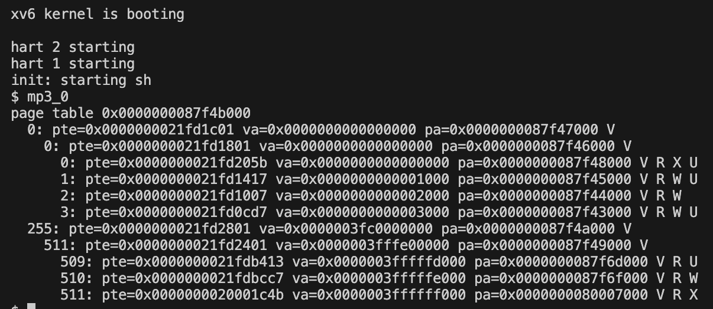
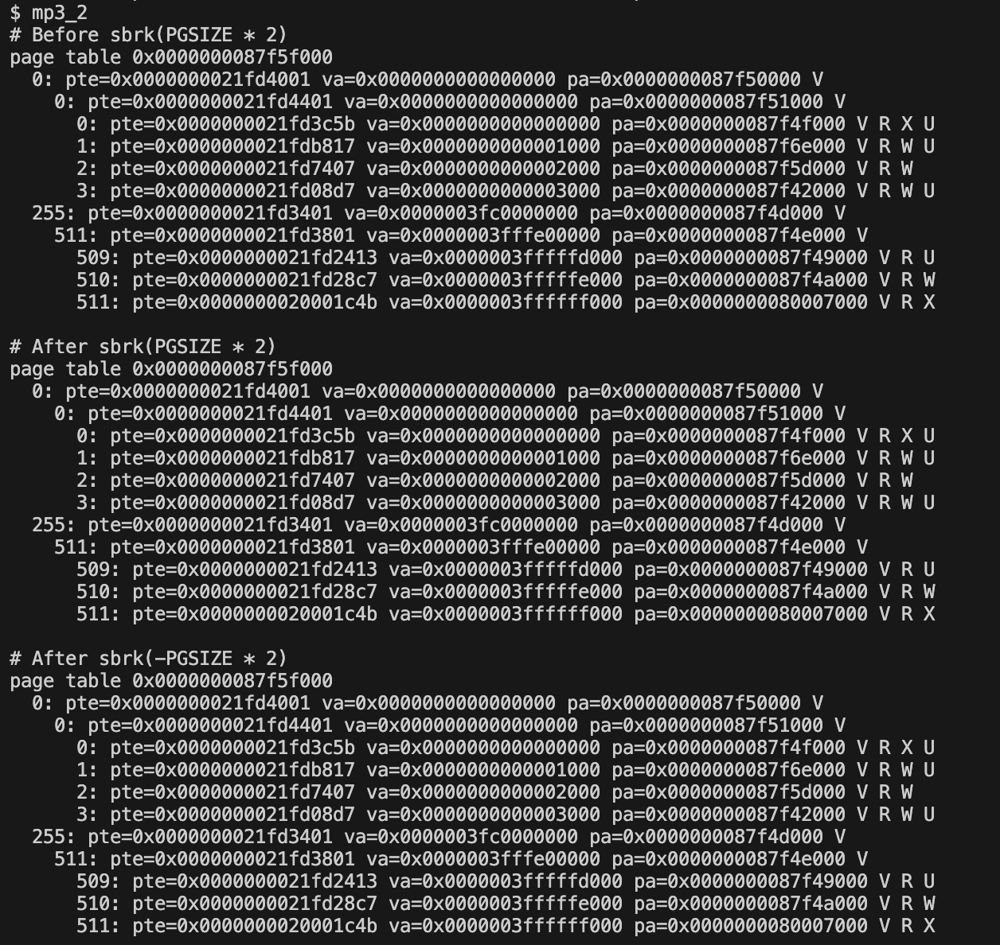
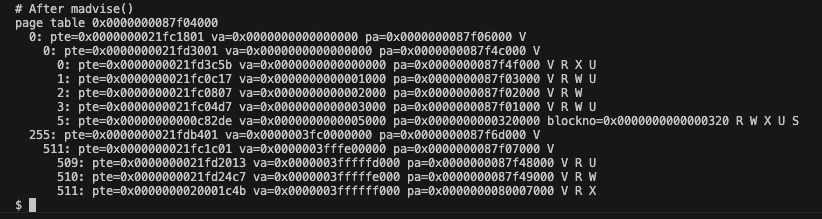
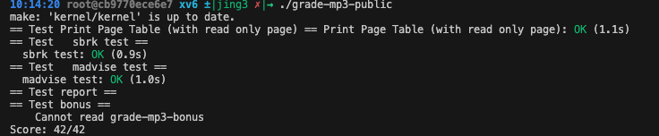

# MP3 report 
  112062527 陳俞靜
  114065501 蔡宛秦

## Table of contents

- [Trace Code](#trace-code)
  - [1. How does xv6 run a user program?](#how-does-xv6-run-a-user-program)
  - [2. How does xv6 allocate physical memory and map it into the process’s virtual address space?](#how-does-xv6-allocate-physical-memory-and-map-it-into-the-processs-virtual-address-space)
- [Implementation](#implementation)
  - [1. Print Page Table](#1-print-page-table)
  - [2. Add a read only share page](#2-add-a-read-only-share-page)
  - [3. Generate a Page Fault](#3-generate-a-page-fault)
  - [4. Demand Paging and Swapping](#4-demand-paging-and-swapping)
- [Test report](#test-report)
- [Bonus report](#bonus)
- [Contributions](#contributions)

＊註：可點擊藍色文字前往查看詳細資訊
## Trace Code
### How does xv6 run a user program?

user program 觸發流程分為兩種路徑：系統啟動時產生第一個 `init`、或是 user program 透過 `fork()`, `exec()` 啟動，以下使用系統啟動路徑做說明

- 控制權 / 程式流程走向 

    (kernel 函式呼叫下一個 kernel 函式。trampoline / sret / trapframe → user 時，箭頭表示 CPU 模式切換和程式跳轉)
    ```c
    main() → userinit() → scheduler()
      ↓
    swtch() → forkret() → usertrapret()
      ↓
    trampoline:userret → sret → initcode (user)
      ↓
    initcode → exec("/init")
      ↓
    exec() → usertrapret() → userret → sret → /bin/sh (user)
    ```
  - 第一次觸發 initcode : 由 kernel `main()` $\to$ `userinit()` $\to$ `scheduler()` $\to$ `swtch()` $\to$ `forkret()` $\to$ `usertrapret()` $\to$ `trampoline:userret` $\to$ `sret` $\to$ `initcode`
  - `exec()` 觸發新程式 : `initcode` 呼叫 `exec("/init")` $\to$ `trap` $\to$ kernel `exec()` $\to$ 更新 trapframe $\to$ `usertrapret()` $\to$ `trampoline:userret` $\to$ `sret` $\to$ `/bin/sh`
  - 控制權（CPU 執行權 / mode）: swtch(), sret 等是控制權轉移點，`swtch()` 將 CPU 從 kernel main process 切到 init process (kernel context)。`sret` 將 CPU 從 kernel 切到 user mode，開始執行 user 程式
  - trapframe : 保存 user 寄存器狀態 (a0..ra, sp, epc)，用於：usertrapret() 設定 CPU 回 user mode。exec() 更新 trapframe 讓新的 user 程式開始執行

  #### 1. `kernel/main.c/main()`
  
  這是 xv6 核心啟動後第一個主要函式，執行 kernel 初始化 (設定 interrupt、準備記憶體管理、建立 proc  table)，接著呼叫 `userinit()` 來建立第一個 user process，struct proc，並呼叫 `proc_pagetable()`  把初始化程式碼 initcode 放到該 process 的 user page table
  最後呼叫 `scheduler()` 正式開始排程循環
  
  > hart：Hardware Thread 的縮寫，代表一個可獨立執行指令的硬體執行緒。如果每個核心支援 2 條硬體執行緒，4 核 心 × 2 執行緒 = 8 個 hart
  
  ```c
  void
  main()
  {
    if(cpuid() == 0){                         // 如果是 CPU 0（主核心）
      ...
      kinit();                                // 初始化實體記憶體分配器 (physical page allocator)
      kvminit();                              // 建立核心分頁表 (kernel page table)
      kvminithart();                          // 啟用分頁 (turn on paging)
      procinit();                             // 初始化程序表 (process table)
      trapinit();                             // 初始化中斷與陷阱向量 (trap vectors)
      trapinithart();                         // 安裝當前 hart 的陷阱向量 (kernel trap vector)
      plicinit();                             // 初始化中斷控制器 PLIC (Platform-Level  Interrupt Controller)
      plicinithart();                         // 啟用當前 hart 的外部中斷 (device interrupts)
      binit();                                // 初始化 buffer cache（磁碟快取）
      iinit();                                // 初始化 inode table（檔案系統 inode）
      fileinit();                             // 初始化檔案表 (file table)
      virtio_disk_init();                     // 初始化 VirtIO 模擬磁碟 (emulated hard disk)
      userinit();                             // 建立第一個使用者程序 (init process)
      __sync_synchronize();                   // 記憶體同步柵欄，確保寫入順序一致
      started = 1;                            // 通知其他 hart：系統已完成初始化
    } else {                                  // 其他 CPU (非 CPU 0)
      while(started == 0);                    // 等待主 CPU 完成初始化
      __sync_synchronize();                   // 記憶體同步，確保看到最新的 started 值
      printf("hart %d starting\n", cpuid());  // 顯示此 hart 正在啟動
      kvminithart();                          // 啟用分頁 (turn on paging)
      trapinithart();                         // 安裝陷阱向量 (trap vector)
      plicinithart();                         // 啟用外部中斷 (enable device interrupts)
    }
  
    scheduler();                              // 進入核心排程
  }
  ```
  
  
  #### 2. `kernel/proc.c/scheduler()`
  
  scheduler 循環地選擇一個 runnable 的 proc（struct proc），把它的 state 設為 RUNNING，並執行   context switch。在切換 context 前要把 process pointer 設好，以便系統呼叫能訪問
  
  > 每個 CPU 都有自己的 scheduler，scheduler() 永遠不會返回，它會一直重複以下步驟 :
  > 1. 選擇一個 RUNNABLE 的行程  
  > 2. 切換到該行程 (swtch) 
  > 3. 當該行程被搶占或結束後，再切回 scheduler()
  
  ```c
  void scheduler(void)
  {
    struct proc *p;                     // 指向目前要排程的 process
    struct cpu *c = mycpu();            // 取得目前執行的 CPU (hart) 結構指標
  
    c->proc = 0;                        // 表示目前 CPU 沒有執行任何 process
    for (;;)                            // 無窮迴圈
    {
      // 為了避免死鎖，允許中斷發生（例如裝置中斷）
      intr_on();                        // 開啟中斷 (enable interrupts)
      for (p = proc; p < &proc[NPROC]; p++) // 掃描整個 process table 尋找可以執行的行程
      {
        acquire(&p->lock);              // 取得該 process 的鎖 (防止競爭條件)
        if (p->state == RUNNABLE)       // 如果該行程可執行 (READY 狀態)
        {
          p->state = RUNNING;           // 將狀態設為 RUNNING，代表它即將執行
          c->proc = p;                  // 將此 process 設為當前 CPU 正在執行的 process
          swtch(&c->context, &p->context); // 切換 context
  
          // 行程執行完畢（或被搶占）後會回到這裡。它應該已經在回來前更新自己的狀態（例如 SLEEPING、  ZOMBIE）
          c->proc = 0;                  // 清空目前 CPU 的執行行程
        }
        release(&p->lock);              // 釋放該行程的鎖
      }
    }
  }
  
  ```
  #### 3. `kernel/switch.S` // 這邊題目應該是說 swtch？？？
  
  > 用 Assembly 寫是因為這邊要掌控 register 與 stack 的狀態，C 語言不能直接控制硬體
  > switch.S 會被 GNU assembler 組譯成 機器碼（object file, .o），然後由 linker (ld) 和其他 .c 檔 （例如 proc.c、sched.c）鏈結，形成 kernel 可執行映像
  
  在 kervel stack 與 registers 之間切換，是 context switch 的底層實作，保存當前 CPU 的上下文並載入下個  process 的上下文
  
  ```c
  .globl swtch // 宣告 swtch 為全域符號，讓 C 程式可呼叫這個函式
  swtch: // 把目前 CPU 的暫存器 (ra, sp, s0-s11) 存進舊的 context 結構
          sd ra, 0(a0) // 儲存 return address
          sd sp, 8(a0) // 儲存 stack pointer，目前 kernel stack 的位置
          sd s0, 16(a0) // 儲存 callee-saved 暫存器 s0 : 被呼叫的函式（callee）要幫呼叫者（caller）保 護、用完要還回去的暫存器
          sd s1, 24(a0) // 儲存 s1
          ...
          sd s11, 104(a0) // 儲存 s1
          // 從新的 context 結構載入新的暫存器
          ld ra, 0(a1) // 載入新的 return address
          ...
          ld s11, 104(a1) // 載入 s11
          
          ret // ra、sp 暫存器已經變成了新 process context。會跳轉回 new process 先前停下的地方
  ```
  
  #### 4. `kernel/proc.c/forkret()`
  
  `main()` 迴圈會呼叫的 `userinit()` 中，init 的 ra (返回地址) 被設定為 forkret，所以當 switch.S 執行 完畢，它會跳轉到 forkret 執行。`forkret()` 是新 process 第一次被 CPU 執行時進入 kernel 的起點，它做初  始化，並讓 CPU 從 kernel mode切回 user mode，正式開始跑使用者程式
  
  ```c
  // A fork child's very first scheduling by scheduler()
  // will swtch to forkret.
  void forkret(void)
  {
    static int first = 1; // // 靜態變數，判斷這是不是第一次進到 forkret()（系統啟動階段）
    // 目前還持有 p->lock
    release(&myproc()->lock); // 把鎖釋放，讓其他 CPU 可以操作這個 process
  
    if (first)
    {
      first = 0;
      fsinit(ROOTDEV); // 若是第一次呼叫 forkret()，則要初始化檔案系統（fsinit）
    }
  
    usertrapret(); // 設定 trap frame，回到 user mode 執行
  }
  ```
  
  #### 5. `kernel/trap.c/usertrapret()`
  
  從 kernel 返回 user space
  - `intr_off();` : CPU 執行 `usertrapret()` (還在 kernel mode) 準備切回 user mode，這時  interrupt 發生的話，CPU 可能直接跳到 `kerneltrap()` 或其他 handler，但還沒把 trap vector 設定好  (stvec $\to$ uservec)，可能進入錯誤的 handler，所以要關閉中斷 `intr_off();`
  - TRAMPOLINE : 固定高位地址程式區，放高位與 user 程式記憶體分開，避免 user mode 可以修改 trampoline， 方便 CPU 直接跳轉
  - `userret()` 的呼叫是發生在最後一行，先把 `trampoline_userret`（也就是 userret 在 `trampoline.S`   的位址） 轉成函式指標：void (*)(uint64)，然後直接傳入參數 satp並呼叫它 (satp 會被放進暫存器 a0)
  
  
  ```c
  void usertrapret(void)
  {
    struct proc *p = myproc(); // myproc() 根據目前的 CPU 目前正在執行的 proc*
    intr_off(); // 把 trap 入口從 kerneltrap() 改成 usertrap()，在切換過程中要先關 interrupt
  
    uint64 trampoline_uservec = TRAMPOLINE + (uservec - trampoline); // 設定 trap 向量  (stvec)，讓下一次 trap 發生時，CPU 會跳到 trampoline.S 裡的 uservec 進行處理
    w_stvec(trampoline_uservec);
  
    // 設定 trapframe，讓下一次 user 程式回 kernel 時使用
    p->trapframe->kernel_satp = r_satp();         // kernel page table
    p->trapframe->kernel_sp = p->kstack + PGSIZE; // process 的 kernel stack
    p->trapframe->kernel_trap = (uint64)usertrap; // kernel trap handler
    p->trapframe->kernel_hartid = r_tp(); // CPU id（hartid）
  
    // 設定 SPP 為 User，表示 sret 回到 user mode
    unsigned long x = r_sstatus(); // 讀取 sstatus CSR
    x &= ~SSTATUS_SPP; // 清除 SPP 位元（0 = user mode）
    x |= SSTATUS_SPIE; // enable interrupts in user mode
    w_sstatus(x); // 寫回 sstatus
  
    w_sepc(p->trapframe->epc); // 將 sepc 設為 user 程式的下一條要執行的指令
  
    uint64 satp = MAKE_SATP(p->pagetable); // 準備切換到 user page table
  
    // 跳到 trampoline.S 的 userret   // 它會：   
    // 1. 切換到 user page table   // 2. 復原 user registers（trapframe 裡的 user context）   //  3. 用 sret 指令切回 user mode
    uint64 trampoline_userret = TRAMPOLINE + (userret - trampoline);
    ((void (*)(uint64))trampoline_userret)(satp); // 傳入 user page table
  }
  ```
  <details>
  <summary><span style="background-color:orange; color:black;">kernel/riscv.h</span></summary>
  kernel/riscv.h 是 xv6-RISCV 核心中最底層標頭檔。它負責定義了所有與 RISC-V 硬體暫存器（CSR）和 分頁系統  （Sv39）有關的操作，
  
  1. riscv.h/intr_off()
  
      ```h riscv.h
      static inline void
      intr_off()
      { // r_sstatus() 讀取 sstatus CSR（Supervisor Status Register）。這個暫存器記錄當前 CPU 的特  權狀態，包含中斷是否啟用
        w_sstatus(r_sstatus() & ~SSTATUS_SIE);  // SSTATUS_SIE 表 Supervisor Interrupt Enable   bit。 當該位元 = 1 $\to$ 中斷啟用，0 則中斷關閉
      } // ~SSTATUS_SIE $\to$ 把 SIE 位元清掉（變成 0） // w_sstatus(...) $\to$ 把修改後的值寫回  sstatus CSR
      ```
  2. memlayout.h : TRAMPOLINE
  
      定義了常數 TRAMPOLINE (記憶體最高頁面)
  
      ```h memlayout.h
      // map the trampoline page to the highest address,
      // in both user and kernel space.
      #define TRAMPOLINE (MAXVA - PGSIZE)
      ```
  3. riscv.h/w_stvec()
  
      Trap 向量表位址，當 CPU 在 S 模式（kernel 模式） 下發生 trap 時， 它會根據這個暫存器的內容決定要跳去  哪個位址執行
  
      ```h riscv.h
      static inline void
      w_stvec(uint64 x)
      {
        asm volatile("csrw stvec, %0" : : "r"(x)); // Inline Assembly，把變數 %0（也就是傳進來的  x）寫入暫存器 stvec
      }
      ```
  
  4. riscv.h/r_satp()
  
      讀取分頁表 base address
      > satp = Supervisor Address Translation and Protection register，是 RISC-V 的分頁控制暫存 器，主要儲存 pagetable base address
  
      ```h riscv.h
      static inline uint64
      r_satp()
      {
        uint64 x;
        asm volatile("csrr %0, satp" : "=r"(x)); // Inline Assembly，從 CSR "satp" 讀出值放進變 數 x
        return x;
      }
      ```
  </details> 
  
  
  #### 6. `kernel/trampoline.S/userret: (Note: In userinit function, we put initcode into the   user page table)`
  
  這邊 `userret` 是由 5. 提到的 `usertrapret()` 在 kernel mode 中準備好 trapframe（儲存 user 狀 態），並呼叫觸發的。`userret()` 是 trap 回復到 user mode 的程式，會切換 page table (kernel $\to$   user pagetable)、從 trapframe 恢復使用者暫存器內容、執行 sret，讓 CPU 回到 user mode，繼續執行 user   code
  
  > sret = Supervisor Return
  
  ```S
  .globl userret
  userret: # 切換到使用者的 page table
          sfence.vma zero, zero # 清除所有 TLB 快取，避免用舊的頁表對應
          csrw satp, a0 # 寫入 CSR 寄存器 satp = 使用者頁表（a0 傳進來）
          sfence.vma zero, zero # 再清一次，確保新的頁表生效
          # 載入 trapframe
          li a0, TRAPFRAME  # a0 : TRAPFRAME 的虛擬位址
  
          # 根據 trapframe 偏移載入各個暫存器的值(每個暫存器的值在 trapframe 內都有固定 offset)
          ld ra, 40(a0) # 恢復 return address
          ld sp, 48(a0) # 恢復 stack pointer
          ...
          ld a0, 112(a0) # 特別處理 a0（syscall return value）
          
          # return to user mode and user pc.
          # usertrapret() set up sstatus and sepc.
          sret # 用 sret 返回 user mode 並跳回 user code
  ```
  #### 7. `kernel/exec.c/exec()`
  
  `exec()` 不建立新 process（pid 不變，他清空舊的使用者記憶體、載入新的程式（ELF 檔）、設定新 stack 和參  數、更新 trapframe（使用者堆疊指標 sp、程式進入點 epc），然後把舊的 user 空間釋放掉、當前 process 直接開  始跑新程式
  
  > ELF (Executable and Linkable Format) : 讓 OS 知道這個程式有哪些 segment、每段要載入到 user  memory 的哪個位址、哪裡是程式的 entry point
  
  ```c
  int
  exec(char *path, char **argv)
  {
    char *s, *last;
    int i, off;
    uint64 argc, sz = 0, sp, ustack[MAXARG], stackbase;
    struct elfhdr elf;
    struct inode *ip; // 對應執行檔的 inode
    struct proghdr ph; // 每個 segment 的表頭
    pagetable_t pagetable = 0, oldpagetable;
    struct proc *p = myproc();
  
    begin_op(); // 開始一個 file system 操作
    if((ip = namei(path)) == 0){ // 根據路徑找到 inode
      end_op();
      return -1;
    }
    ilock(ip); // 鎖住 inode（防止其他人修改）
  
    // Check ELF header
    if(readi(ip, 0, (uint64)&elf, 0, sizeof(elf)) != sizeof(elf))
      goto bad;
  
    if(elf.magic != ELF_MAGIC)
      goto bad;
  
    if((pagetable = proc_pagetable(p)) == 0) // 呼叫 proc_pagetable() 建立一個全新的分頁表
      goto bad;
  
    // 載入 ELF 各段到記憶體
    for(i=0, off=elf.phoff; i<elf.phnum; i++, off+=sizeof(ph)){
      if(readi(ip, 0, (uint64)&ph, off, sizeof(ph)) != sizeof(ph))
        goto bad;
      if(ph.type != ELF_PROG_LOAD)
        continue;
      if(ph.memsz < ph.filesz)
        goto bad;
      if(ph.vaddr + ph.memsz < ph.vaddr)
        goto bad;
      if(ph.vaddr % PGSIZE != 0)
        goto bad;
      uint64 sz1;
      if((sz1 = uvmalloc(pagetable, sz, ph.vaddr + ph.memsz, flags2perm(ph.flags))) == 0)
        goto bad;
      sz = sz1;
      if(loadseg(pagetable, ph.vaddr, ip, ph.off, ph.filesz) < 0)
        goto bad;
    }
    // 建立 stack
    // 把 argv 指標陣列也放進 user stack
    ...
  
    // 設定程式名稱與 trapframe
    p->trapframe->a1 = sp;
  
    // Save program name for debugging.
    for(last=s=path; *s; s++)
      if(*s == '/')
        last = s+1;
    safestrcpy(p->name, last, sizeof(p->name));
      
    // Commit to the user image.
    oldpagetable = p->pagetable;
    p->pagetable = pagetable;
    p->sz = sz;
    p->trapframe->epc = elf.entry;  // initial program counter = main
    p->trapframe->sp = sp; // initial stack pointer
    proc_freepagetable(oldpagetable, oldsz);
  
    return argc; // this ends up in a0, the first argument to main(argc, argv)
    ...
  }
  ```
### How does xv6 allocate physical memory and map it into the process’s virtual address space?

- 前提
  ```c
  user code：sbrk(n)→ 觸發系統呼叫
    ↓
  sys_sbrk()
    ↓
    argint(0, &n) (取得調整 byte 數)
    ↓
    addr = myproc()->sz (記錄舊的 program break)
    ↓
    growproc(n)
      ↓
      sz = p->sz (當前 program break)
      ↓
    n > 0 ? → uvmalloc(p->pagetable, sz, sz+n, PTE_W) → 失敗? → return -1
              ↓ 成功
              sz = newsz
      ↓
    n < 0 ? → sz = uvmdealloc(p->pagetable, sz, sz+n)
      ↓
      p->sz = sz (更新 program break)
      ↓
      return 0
    ↓
    return addr (舊的 program break) or -1 (失敗)
  ```


  #### 1. user/user.h/sbrk()
  `sbrk`用途：調整heap大小。這是 malloc 的底層接口。使用者空間的記憶體配置器（malloc）需要更多 heap 時呼  叫 `syscall sbrk` 向 kernel 要一塊更大的連續虛擬位址範圍。
  
  ```c
  // system calls
  char *sbrk(int);
  ```
  
  #### 2. user/usys.pl
  `usys.pl` 產生stub腳本。
  ```c
  sub entry {
      my $name = shift;
      print ".global $name\n";
      print "${name}:\n";
      print " li a7, SYS_${name}\n";  // 把 SYS_sbrk 12 號碼放進 $a7 
      print " ecall\n";               // 進 kernel
      print " ret\n";
  }
  
  entry("sbrk");
  ```
  
  #### 3. kernel/sysproc.c/sys_sbrk()
  `sbrk`：set break，依照參數調整 heap 的 break addr。
  呼叫 growproc(n)後。若執行失敗回 -1，否則回舊的 addr。
  
  
  ```c
  // mp3 TODO
  uint64
  sys_sbrk(void)
  {
    uint64 addr;
    int n;
  
    argint(0, &n);        //參數 n，想調整的 byte 數
    addr = myproc()->sz;  //目前的 p->sz，program break（程式斷點位址）當回傳值 addr。
    if (growproc(n) < 0)  //呼叫 growproc
      return -1;
    return addr;
  }
  ```
  #### 4. kernel/proc.c/growproc()
  `growproc()` 位址空間調整器，一般流程。因為它當下就做 kalloc/mappages 或 uvmdealloc，沒有等到 page  fault 才配。
  
   - `n > 0`：呼叫 uvmalloc() → 配置實體頁 (kalloc) 並映射 (mappages)；
   - `n < 0`：uvmun map() 釋放對應頁並更新 p->sz。
  
  
  <details>
  <summary><span style="background-color:orange; color:black;">riscv.h 附加權限位</span></summary>

  Page Table Entry Permission bit
    - `PTE_V（Valid）`：此 PTE 有效（頁存在或指向下一層頁表）。\
    - `PTE_R / _W / _X`：分別控制「讀 / 寫 / 執行」三種權限。\
    - `PTE_U`：決定使用者態能不能碰這頁:U=1：user 可以依 R/W/X 權限使用。
  U=0：只限 kernel（S 模式）；user 碰了會 fault。\
    - `PTE_S`（swapped）：頁在磁碟；需 swap-in 才能用。通常與 V=0 搭配，避免被誤當成在記憶體。
  
  </details>
  
  ```c
  int growproc(int n)
  {
    uint64 sz;
    struct proc *p = myproc();
  
    sz = p->sz; // p->sz ，sz 當作目前的 program break
    if (n > 0){
       if ((sz = uvmalloc(p->pagetable, sz, sz + n, PTE_W)) == 0)
        {return -1;}
      }
    
    else if (n < 0)
      {sz = uvmdealloc(p->pagetable, sz, sz + n);}
    
    p->sz = sz;
    return 0;
  }
  ```
  
  #### 5. kernel/vm.c/uvmalloc()
  逐頁 kalloc() + mappages() 把 VA→PA 建好，回傳新 sz（失敗回 0）。
  
  ```c
  // 配置 PTEs 和實體記憶體給程式從 oldsz 到 newsz （皆不用頁對齊）
  // Returns new size or 0 on error.
  uint64
  uvmalloc(pagetable_t pagetable, uint64 oldsz, uint64 newsz, int xperm)
  {
    char *mem;  // 指向新分配的實體頁
    uint64 a;   // 用來在位址空間中走訪每一頁（虛擬位址）
  
    if (newsz < oldsz)  // 若要減少，不處理，return原大小
      return oldsz;
  
    oldsz = PGROUNDUP(oldsz); // 將原先大小位址對齊 4096 bytes（整頁）
    for (a = oldsz; a < newsz; a += PGSIZE) //從原先大小位址，每次增加一頁
    {
      mem = kalloc();   // 從 mem addr 開始分配一頁（4KB）新的實體記憶體空間
      if (mem == 0)     // 若是 0，分配失敗，將前面已分配的頁都釋放
      {
        uvmdealloc(pagetable, a, oldsz);   // 把 p 的 user memory 從 a 縮小到 oldsz，並解除映射 ＋釋放掉。
        return 0;
      }
      memset(mem, 0, PGSIZE); // 從 mem 開始，連續 PGSIZE 個 byte 全部設成 0
      if (mappages(pagetable, a, PGSIZE, (uint64)mem, PTE_R | PTE_U | xperm) != 0)    // 在這 個 pagetable 裡，把虛擬位址範圍 [a, a + PGSIZE) 映射到實體位址 mem 這一頁，並設定權限 = PTE_R |  PTE_U | xperm。
      {                       // 若失敗則復原
          kfree(mem);         // 把一頁實體記憶體還給核心
        uvmdealloc(pagetable, a, oldsz);
        return 0;
      }
    }
    return newsz;
  }
  
  ```
  
  ```c
  uvmalloc(pagetable, oldsz, newsz, xperm)
    ↓
    newsz < oldsz ? → return oldsz (不處理縮小)
    ↓
    oldsz = PGROUNDUP(oldsz) (對齊頁邊界)
    ↓
    for each page (a = oldsz; a < newsz; a += PGSIZE)
      ↓
      mem = kalloc() (分配一頁實體記憶體 4KB) → 失敗? → uvmdealloc() → return 0
      ↓ 成功
      memset(mem, 0, PGSIZE) (清零整頁)
      ↓
      mappages(pagetable, a, PGSIZE, mem, PTE_R|PTE_U|xperm) → 失敗? → kfree(mem) + uvmdealloc  () → return 0
      ↓ 成功
    return newsz
  ```


## Implementation

### 1. Print Page Table

#### a. `vm.c`
遞迴列印三層 paging table。xv6 三層的結構是：L2：最高層、L1：中層、L0：最低層（leaf），每層各使用 9 bits index，offset 使用 12 bits

- `vmprint(pagetable_t pagetable)`

    主函式，印出 page table 的起始位置、呼叫 `vmprint_walk()`，從 level = 2 (最上層) 開始走訪，vaprefix = 0，表示目前 VA 尚未累積
    > `vmprint_walk(pagetable_t pt, int level, uint64 vaprefix)` : pt 是L2 頁表的起始位址、從最上層 level 開始、vaprefix 目前累積的 VA prefix
    
    
    ```c

    /* Print multi layer page table. */
    void vmprint(pagetable_t pagetable)
    {
      /* mp3 TODO */
      // panic("not implemented yet\n");
      printf("page table %p\n", pagetable); // ADD
      // vmprint_recursive(pagetable, 3); // ADD
      vmprint_walk(pagetable, 2, 0);
    }
    ```

- `vmprint_walk(pagetable_t pt, int level, uint64 vaprefix)`

    走訪 page table tree，遍歷 512 個 PTE (每層 page table index = 9 bits，2^9 = 512 entries)，若 PTE_V = 0，則是無效 PTE，要skip；若 PTE_V = 1 則是有效，要印出資訊

    > Sv39 規格算 VA：Sv39 是 RISC-V 的虛擬記憶體格式，S = Supervisor-level virtual memory、v = virtual memory scheme、39 = 使用 39-bit VA（其餘為 sign-extension）。
    > 每層 index 是 9 bits、offset 是 12 bits ( 位移計算 index << (level*9 + 12) )。例如：level=2 → idx << 30 → VA[38:30] 、level=1 → idx << 21 → VA[29:21] 、level=0 → idx << 12 → VA[20:12]

    ```c
    // PTE2PA 會把 PTE 的 PPN 抽出來，並轉成 page-aligned physical address
    PTE2PA = (0x0000000123456781 >> 10) << 12
          = PPN << 12
          = physical address (page-aligned)
          
    // Sv39 虛擬位址拆法
    [ VA[38:30] ][ VA[29:21] ][ VA[20:12] ][ VA[11:0] ]
      L2          L1           L0         offset

    // Sv39 實體地址拆法
    [ PPN2 ][ PPN1 ][ PPN0 ][ offset ]
    ```

    ```c
    static void vmprint_walk(pagetable_t pt, int level, uint64 vaprefix){
      for(int idx = 0; idx < 512; idx++){
        pte_t pte = pt[idx];
        if((pte & PTE_V) == 0) continue;

        uint64 pa = PTE2PA(pte); // 把 PTE 中的 PPN 轉成 physical address

        // 計算當前節點代表的 VA（去掉 offset）
        // Sv39: 每層 9bits，offset 12bits
        int shift = level * 9 + 12;          // 2->30, 1->21, 0->12
        uint64 va_here = vaprefix | ((uint64)idx << shift);

        print_spaces(2 * (3 - level)); // 縮排空白
        printf("%d: pte=%p va=%p pa=%p", idx, pte, va_here, pa); // 輸出：`<indent><idx>: pte=<pte hex> va=<va> pa=<pa> [FLAGS]`
        print_flags(pte);
        printf("\n");

        if((pte & (PTE_R|PTE_W|PTE_X)) == 0 && level > 0){ // 若不是 leaf（沒有 R/W/X），代表這個 PTE 指向下一層 page table
          vmprint_walk((pagetable_t)pa, level - 1, va_here);
        }
      }
    }
    ```

- `print_spaces(int n)`, `print_flags`

    - `print_spaces(int n)` 負責縮排，因每一層輸出格式不同

        > 縮排規則：2 * (3 - level) 空白

        | level  | 層數  | 縮排  |
        | :--- | :------- | :---- |
        | 2	| L2 | 2 spaces |
        | 1 | L1 | 4 spaces |
        | 0 | L0 | 6 spaces|

    - `print_flags` 印出 V/ R/ W/ X/ U flag，根據 PTE 的 flag bit：
      - V (valid)
      - R/ W/ X (leaf) 標記 (代表是 actual physical page)
      - U (user page)  
    (如剛剛 `vmprint_walk()` 提到的，遞迴能不能往下走的核心判斷試看哪些 flag 是不是 leaf，R/W/X 中至少一個為 1 就是 leaf，會指向 physical page；若全部 = 0，則指向下一層 page table)

    ```c
    static void print_spaces(int n){
      for(int i = 0; i < n; i++) printf(" ");
    }

    static void print_flags(pte_t pte){
      if(pte & PTE_V) printf(" V");
      if(pte & PTE_R) printf(" R");
      if(pte & PTE_W) printf(" W");
      if(pte & PTE_X) printf(" X");
      if(pte & PTE_U) printf(" U");
    }
    ```
### 2. Add a read only share page
- `simplified vDSO`：Kernel 有一些資訊想給 user 空間看（這裡只放 pid）。\
為了避免每次查詢 PID 都進行 user→kernel 的 mode switch，我們把 kernel 準備好的資訊放在一個 read-only 的 USYSCALL page，直接映射到 user 虛擬位址空間，讓 user 程式以一般讀記憶體的方式就能取得 PID。
- `memlayout.h`：定義 USYSCALL 位址與 usyscall 結構
 
  ```c
  #ifdef LAB_PGTBL // 包起來，確保只在本 lab 啟用
  #define USYSCALL (TRAPFRAME - PGSIZE) // 常數 USYSCALL，作為所有 process 固定的虛擬位址

  struct usyscall { //定義共享頁面中要存放的資訊格式。
    int pid;
  };
  #endif
  ```
- `makefile`：啟用 LAB_PGTBL 相關設定
  ```makefile
  LAB=pgtbl # ADD
  ...
  CFLAGS = ... -DLAB_PGTBL # ADD,  open LAB_PGTBL
  ```

#### a. `proc.h` `proc.c`
- `proc.h`
  ```h
  // ADD
  #ifdef LAB_PGTBL
  struct usyscall *usyscall;   // pointer to read-only user syscall page
  #endif
  ```
  `proc.c/alloproc()`：
  原本 allocproc() 會：分配 trapframe，建立 page table。
  現在在 trapframe 分配後，新增分配一頁實體記憶體給 `usyscall`。
  ```c
  #include "vm.h" //// ADD
  ...
  static struct proc *
  allocproc(void)
  {
    struct proc *p;

    for (p = proc; p < &proc[NPROC]; p++)
    {
    acquire(&p->lock);      // 成功找到未使用 p 在pagetable裡，上所執行後續動作
    ...
    p->trapframe = (struct trapframe*)kalloc();}
    ...

    //// ADD
  #ifdef LAB_PGTBL
    // allocate one physical page for the read-only usyscall page
    p->usyscall = kalloc(); // kalloc()：為 usyscall page 分配一整頁實體記憶體。
    if(p->usyscall == 0){   // 若分配失敗，呼叫 freeproc(p) 清掉先前配置的資源，在返回0。
      freeproc(p);
      release(&p->lock);    // 並釋放鎖
      return 0;
    }
    memset(p->usyscall, 0, PGSIZE);   // memset：把整頁清零，避免殘留舊資料。
    ((struct usyscall*)p->usyscall)->pid = p->pid;
  #endif

    p->pagetable = proc_pagetable(p); // An empty user page table.
    ...
  }
  ```
  `freeproc()`：新增釋放usyscall指向的實體記憶體。
  ```c
  // free a proc structure and the data hanging from it,including user pages.
  // p->lock must be held.
  static void
  freeproc(struct proc *p)
  {
    if(p->trapframe) kfree(p->trapframe); // 釋放 trapframe
    p->trapframe = 0;

    ////Add
  #ifdef LAB_PGTBL
    if(p->usyscall){
      kfree(p->usyscall);                 // 釋放pointer指向的實體記憶頁
      p->usyscall = 0;
    }
  #endif

    if(p->pagetable)
      proc_freepagetable(p->pagetable, p->sz);
    p->pagetable = 0;
    ...
    p->state = UNUSED;                     // 將 p 一系列狀態初始化
  }

  ```
  `proc_pagetable()`：幫每個 p 建一份user page table，加上新增USYSCALL的實作
  - `mappages()`：把某個 PA 掛到某個 VA
  ```c
  pagetable_t
  proc_pagetable(struct proc *p)
  {
    pagetable_t pagetable = uvmcreate();  // 為p建一個全新使用者分頁表(root pagetable)
    if(pagetable == 0)                    // 失敗，return 0
      return 0;
  
    // 1) 映射 TRAMPOLINE(固定ＶＡ)到實體記憶體位址(trampoline)，對kernel可讀、執行
    if(mappages(pagetable, TRAMPOLINE, PGSIZE,
                (uint64)trampoline, PTE_R|PTE_X) < 0){
      uvmfree(pagetable, 0);              // 若失敗，清除釋放 pagetable
      return 0;
    }
  
  #ifdef LAB_PGTBL  ////ADD
    // 2) 映射 USYSCALL (VA) 到 p->usyscall (PA) (user可讀)
    if(mappages(pagetable, USYSCALL, PGSIZE,
                (uint64)p->usyscall, PTE_U | PTE_R) < 0){
      uvmunmap(pagetable, TRAMPOLINE, 1, 0);// 若失敗，先unmap TRAMPOLINE 再釋放
      uvmfree(pagetable, 0);
      return 0;
    }
  #endif
  
    
    if(mappages(pagetable, TRAPFRAME, PGSIZE,// 只對kernel可讀可寫
                (uint64)p->trapframe, PTE_R|PTE_W) < 0){
  #ifdef LAB_PGTBL  //// ADD，也要unmap 新增的USYSCALL
      uvmunmap(pagetable, USYSCALL, 1, 0);
  #endif
      uvmunmap(pagetable, TRAMPOLINE, 1, 0);
      uvmfree(pagetable, 0);
      return 0;
    }
  
    return pagetable;
  }
  ```
  `proc_freepagetable()`：釋放 p 的整份使用者頁表，並確保整個 VA 空間被完整回收
  ```c
  void
  proc_freepagetable(pagetable_t pagetable, uint64 sz)
  {
    // 這三個固定區塊都在 sz 以上，先拆掉（do_free=0）
    uvmunmap(pagetable, TRAMPOLINE, 1, 0);
    uvmunmap(pagetable, TRAPFRAME, 1, 0);
  #ifdef LAB_PGTBL  // 新增對USYSCALL動作
    uvmunmap(pagetable, USYSCALL, 1, 0);
  #endif
  
    // 再讓 uvmfree 負責把 0..sz 的 user 區域逐頁解掉並釋放 page-table
    uvmfree(pagetable, sz);
  }
  ```


### 3. Generate a Page Fault

流程：User program 呼叫 $\to$ 在 `user/usys.S` 呼叫 `sbrk(n)` ，`sbrk()` 在 user space 用 ecall 進 kernel $\to$ 切換到 kernel mode `kernel/syscall.c:syscall()` (查表 dispatch) $\to$  `kernel/sysproc.c:sys_sbrk()` 做 lazy allocation: 只改 sz $\to$ return to user space

**Lazy Allocation**：`sbrk(n)`只修改虛擬位址空間大小 (sz)，不立即分配 page。當程式實際訪問尚未分配的頁面時，才觸發 page fault，動態分配記憶體

- `user/usys.S` 定義

    ```S
    .global sbrk
    sbrk:
    li a7, SYS_sbrk # 把 系統呼叫號碼 放進暫存器 a7 #define SYS_sbrk 12 -> a7 = 12 代表要呼叫第 12 號 syscall，也就是 sys_sbrk
    ecall # ecall 跳入 kernel mode
    ret
    ```

#### a. `sysproc.c`
- `sys_sbrk(void)`

    將原本會呼叫 `growproc(n)` 的部分改成只調整 myproc()->sz：，`argint(0, &n)` 讀使用者傳進來的 n（`sbrk(n)` 的參數），如果 n > 0，則只修改 sz，不分配
    page；如果 n < 0，使用 `uvmunmap`釋放尾端頁

    > sz : process 目前使用的虛擬位址空間大小 <br>
    > sbrk(-4096)：把 heap 從上往下 shrink
    >

    ```c sysproc.c
    // mp3 TODO
    uint64
    sys_sbrk(void)
    {
      // 原本的程式
      // uint64 addr;
      // int n;

      // argint(0, &n);
      // addr = myproc()->sz;
      // if (growproc(n) < 0)
      //   return -1;
      // return addr;

      // ADD TODO 3
      int n;
      argint(0, &n); // 取得使用者的 sbrk(n) 參數
      struct proc *p = myproc(); // 取得目前正在執行的 process
      uint64 addr = p->sz; // 舊的 heap break
      
      if (n < 0) {
        // shrink: 釋放最後 n bytes 對應的頁面
        uvmdealloc(p->pagetable, p->sz, p->sz + n);
      }
      p->sz += n;  // 只改大小，不配置。告訴 OS process 的 heap 變大

      return addr;
    } 
    ```
  - 註：`proc.h` struct proc

    其中 `sys_sbrk(void)` 用 `myproc()` 找目前 CPU ID、根據 CPU 的 proc pointer 回傳該 process 的 struct

    ```c proc.h
    struct proc {
      uint64 sz;               // process 的記憶體大小（bytes）
      pagetable_t pagetable;   // page table root
      char name[16];           // process name
      int pid;                 // process id
      struct trapframe *trapframe;
      ...
    };
    ```

#### b. `trap.c`

- `usertrap(void)`

    usertrap() 是當 user 程式 在執行時發生 trap 時，CPU 會跳到這裡處理 Page Fault。於 `usertrap()` 增加判斷。`r_scause()` 讀取 trap 原因，13 = Load Page Fault、15 = Store/AMO Page Fault，在 `usertrap()` 若遇到這種錯誤，會呼叫 `handle_pgfault()` 來動態分配頁面

    ```c trap.c
    void usertrap(void)
    {
      int which_dev = 0; // 紀錄是否是 device interrupt 
      if ((r_sstatus() & SSTATUS_SPP) != 0) // 安全檢查，SPP != 0 → trap 不是 user mode 來的 → panic。因 usertrap 只能處理 user 程式的 trap
        panic("usertrap: not from user mode");

      w_stvec((uint64)kernelvec); // CPU 進入 kernel mode
      struct proc *p = myproc(); // 取得目前正在執行的 process 結構
      p->trapframe->epc = r_sepc(); // 將 user 程式目前的程式計數器 (epc) 存進 trapframe，回到 user mode 時恢復程式執行
      // mp3 TODO
      if (r_scause() == 8) // scause = 8 表示 Environment call from U-mode
      {
        if (killed(p)) // process 已經被標記 killed → 直接退出
          exit(-1);
        p->trapframe->epc += 4; // ecall 指令長度 4 bytes
        intr_on(); // 允許 CPU 處理 interrupt
        syscall(); // 呼叫 system call handler
      }
      else if ((which_dev = devintr()) != 0) // 呼叫 devintr() 判斷是不是 device interrupt，若是就設定 which_dev
      {
        // ok
      }
      // ADD TODO 3 // Lazy Allocation
      else if (r_scause() == 13 || r_scause() == 15)
      {
        // 13: load page fault, 15: store page fault
        uint64 va = r_stval();  // fault 的虛擬位址
        if (handle_pgfault(va) == 0) {  // 成功處理 page fault，不需要 kill process，handle_pgfault(va) 動態分配 page
        } else {
          printf("usertrap(): page fault not handled, pid=%d va=%p\n", p->pid, va);
          setkilled(p);
        }
      }
      ... // 未知 trap 打印訊息並殺掉 process。若在任何步驟被標記 killed 就結束 process
      if (which_dev == 2) // 處理 timer interrupt
        yield(); // 調度其他 process，讓 CPU 共享

      usertrapret(); // 返回 user mode，恢復 trapframe 與 user context、回到 user 程式繼續執行
    }
    ```

#### c. `paging.c`

- `handle_pgfault(uint64 va)`

    真正分配頁面的地方

    ```c
    int handle_pgfault(uint64 va) // ADD TODO 3 int handle_pgfault()
    {
        struct proc *p = myproc();
        va = PGROUNDDOWN(va);  // 對齊到頁起始位址

        // 檢查 fault 位址是否在合法範圍
        if (va >= p->sz || va < 0)
            return -1; // 超過 heap 範圍 → 無效訪問

        char *mem = kalloc(); // 配置一 page physical mem.
        if (mem == 0)
            return -1;

        memset(mem, 0, PGSIZE); // 清空內容
        if (mappages(p->pagetable, va, PGSIZE, (uint64)mem,
                    PTE_R | PTE_W | PTE_X | PTE_U) != 0) {
            kfree(mem);
            return -1;
        }
        return 0;
    }
    ```

#### d. `vm.c`

- `uvmunmap(pagetable_t pagetable, uint64 va, uint64 npages, int do_free)`

    忽略未映射頁面。以前 uvmunmap 對未映射頁面會 panic，改成 lazy allocation 後，有些頁面可能還沒分配 → 不能 panic

    ```c vm.c
    void uvmunmap(pagetable_t pagetable, uint64 va, uint64 npages, int do_free)
    {
      uint64 a;
      pte_t *pte;
      ...
      for (a = va; a < va + npages * PGSIZE; a += PGSIZE)
      {
        if ((pte = walk(pagetable, a, 0)) == 0)
          panic("uvmunmap: walk");
        if ((*pte & PTE_V) == 0)
          // panic("uvmunmap: not mapped"); // DEL TODO3
          continue; // ADD TODO3 
        ...
      }
    }
    ```


### 4. Demand Paging and Swapping

#### a. `paging.c`：handle_pgfault() 的 page fault 流程
1. `Page Fault` 觸發時機： CPU 存取一個 virtual address，但對應的 PTE 不是 PTE_V=1 時，會觸發 page fault
在 xv6 中，這會進入 usertrap() → 檢查到 scause 是 page fault → 呼叫 handle_pgfault()
2. 核心邏輯： 合法性檢查，使用`walk()`取得 PTE 並判斷狀態：
    - Case 1：頁面完全未分配（PTE_V=0, PTE_S=0）→ lazy alloc
    - Case 2：頁面在 swap space（PTE_S=1, PTE_V=0）→ swapin_page()
    - 其他錯誤情況
    ```c
    /* Page fault handler */
    int handle_pgfault(uint64 va) 
    {
        /* mp3 TODO */
        struct proc *p = myproc();
        va = PGROUNDDOWN(va);       // 對齊頁邊界

        if (va >= p->sz || va < 0)  // 檢查 fault 位址是否在合法範圍
            return -1;

        pte_t *pte = walk(p->pagetable, va, 0);
        if(pte == 0 || (*pte & (PTE_V | PTE_S)) == 0){  // case 1（PTE_V=0, PTE_S=0）→ lazy alloc
            char *mem = kalloc();                       // 分配一個新的 physical page
            if (mem == 0)
                return -1;

            memset(mem, 0, PGSIZE);                     // 初始化 physical page
            *pte = PA2PTE((uint64)mem) | PTE_U | PTE_R | PTE_W | PTE_X | PTE_V;

            return 0;

        }else if((*pte & PTE_S) && !(*pte & PTE_V)){    //  case 2（PTE_S=1, PTE_V=0）→ swapin_page()
            if(swapin_page(p->pagetable, va, pte) < 0){
                return -1;
            }

            return 0;
        }
        return -1;

        // panic("not implemented yet\n");
    }
    ```


#### b. `vm.c` : `swapout_page`，`swapin_page`新增這兩個函式，修改 `madvise()` 並新增實作功能
  - `swapout_page()`：RAM → disk
    ```
      63        54 53      10 9  8  7  6  5  4  3  2  1  0
    ┌───────────┬──────────┬──┬──┬──┬──┬──┬──┬──┬──┬──┬──┐
    │ Reserved  │ Block#   │  │  │  │  │U │X │W │R │S1│V0│
    └───────────┴──────────┴──┴──┴──┴──┴──┴──┴──┴──┴──┴──┘
                  ↑ Block Number in swap space (swap位址)
    ```

    ```c
    static int
    swapout_page(pagetable_t pagetable, uint64 va, pte_t *pte)
    {
        if((*pte & PTE_V) == 0)   // 頁面必須在實體記憶體中 (PTE_V=1) 
            return -1;

        uint64 pa = PTE2PA(*pte); // 從 PTE 取得 physical address
        if(pa == 0)
            return -1;

        begin_op();
        int blockno = balloc_page(ROOTDEV); //在 swap space 中分配一個 block
        if(blockno == (uint64)-1){
          end_op();
          return -1;
        }
        write_page_to_disk(ROOTDEV, (char*)pa, blockno);  // 把頁面內容寫到 disk
        end_op();
        
        kfree((void*)pa); // 釋放掉該頁的實體記憶體

        uint flags = PTE_FLAGS(*pte); // 更新 PTE
        flags &= ~PTE_V;   // 清除 PTE_V
        flags |= PTE_S;    // 設定 PTE_S

        *pte = BLOCKNO2PTE(blockno) | flags;  // 高位設 blocknum 組成新 PTE 值
        sfence_vma();

        return 0;
    }
    ```
  - `swapin_page()`：disk → RAM
    ```
      63        54 53      10 9  8  7  6  5  4  3  2  1  0
    ┌───────────┬──────────┬──┬──┬──┬──┬──┬──┬──┬──┬──┬──┐
    │ Reserved  │   PPN    │  │  │  │  │U │X │W │R │S0│V1│
    └───────────┴──────────┴──┴──┴──┴──┴──┴──┴──┴──┴──┴──┘
                  ↑ Physical Page Number
      ```
    ```c
    static int
    swapin_page(pagetable_t pagetable, uint64 va, pte_t *pte)
    {
        if(!(*pte & PTE_S) || (*pte & PTE_V)) // 檢查 PTE 是否標記為 swapped（PTE_S=1, PTE_V=0）
            return -1;
    
        uint64 blockno = PTE2BLOCKNO(*pte);   // 從 PTE 取出 block number
    
        char *mem = kalloc();                 // 分配一個新的 physical page
        if(mem == 0)
            return -1;
    
        begin_op();
        read_page_from_disk(ROOTDEV, mem, blockno); // 從 disk 讀取頁面內容
        bfree_page(ROOTDEV, blockno);         // 釋放 swap space 中的 block
        end_op();
    
        uint flags = PTE_FLAGS(*pte); // 更新 PTE
        flags &= ~PTE_S;  // 清除 PTE_S
        flags |= PTE_V;   // 設定 PTE_V
    
        *pte = PA2PTE((uint64)mem) | flags;   // 高位設 physical addr 組成新 PTE 值
    
        return 0;
    }
    ```
  - `madvise()`：process 明確告訴 kernel 如何管理記憶體 \
    由 user space program 主動呼叫（system call）。例子：資料庫系統：在查詢前用 MADV_WILLNEED 預載索引 ; 多媒體播放器：播放完一段後用 MADV_DONTNEED 釋放 buffer

    - MADV_NORMAL：告知 kernel 存取模式
    - MADV_DONTNEED：釋放暫時不用的記憶體
    - MADV_WILLNEED：預先載入即將使用的資料
    - 錯誤預設情況
    ```c
    /* Map pages to physical memory or swap space. */
    int madvise(uint64 base, uint64 len, int advice)
    {
      /* mp3 TODO */
      struct proc *p = myproc();
      uint64 sz = p->sz;

      if(len == 0) return 0;    // 長度為 0：什麼都不做，算成功
      if(base >= sz) return -1; // 避免 overflow：base+len 溢位 或 直接越界
      if(base + len < base) return -1;  // overflow
      if(base + len > sz) return -1;    // 覆蓋到 process memory 外
  

      uint64 a    = PGROUNDDOWN(base);  // page 對齊
      uint64 last = PGROUNDDOWN(base + len - 1);

      switch(advice){
      case MADV_NORMAL:     // 只做合法性檢查，上面已有
        break;

      case MADV_DONTNEED:   // 將指定範圍內在記憶體中的有效頁面 swapout 到 disk
        for(uint64 va = a; va <= last; va += PGSIZE){
          pte_t *pte = walk(p->pagetable, va, 0); // 遍歷範圍內的每個 page
          if(pte && (*pte & PTE_V)){              // 對（PTE_V=1）頁面 swapout_page
            if(swapout_page(p->pagetable, va, pte) < 0)
            return -1;
          }

        }
        break;

      case MADV_WILLNEED:   // 將指定範圍內的頁面預先載入到記憶體中，分兩 case
        for(uint64 va = a; va <= last; va += PGSIZE){     // 遍歷範圍內的每個 page
          pte_t *pte = walk(p->pagetable, va, 1);         // alloc=1，如中間層的 pagetable 不存在，會自動建立
          if (pte == 0)
            return -1;

          if((*pte & (PTE_V | PTE_S)) == 0){  // case 1：頁面完全沒配置 
            char *mem = kalloc();             // 直接分配新的實體記憶體
            if(mem == 0)
              return -1; 
            memset(mem, 0, PGSIZE);           // 初始化為 0
            *pte = PA2PTE((uint64)mem) | PTE_U | PTE_R | PTE_W | PTE_V;
          } 
          else if((*pte & PTE_S) && !(*pte & PTE_V)){ // case 2：頁面在 swap space
            if(swapin_page(p->pagetable, va, pte) < 0)// 從 disk 讀回來
              return -1;
          } 
        }
      break;

      default:      // 不認得的 advice
        return -1;
      }
      sfence_vma(); // 刷新 TLB，確保 CPU 看到最新的 PTE
      return 0;
    }


    ```

  - `vmprint()`：新增對swapped page的處理
    ```c
    static void vmprint_walk(pagetable_t pt, int level, uint64vaprefix){
      for(int idx = 0; idx < 512; idx++){
        pte_t pte = pt[idx];
        if((pte & PTE_V) == 0 && (pte & PTE_S) == 0)  // 新增檢查 _S bit，讓 swapped page 也會被印出來
          continue;
        ...
        printf("%d: pte=%p va=%p pa=%p", idx, pte, va_here, pa);
        if((pte & PTE_S) && !(pte & PTE_V)){ // 對被 swapped page 印出 blockno（有s bit且沒有在記憶體裡）
          uint64 blockno = PTE2BLOCKNO(pte);
          printf(" blockno=%p", blockno);
        }
        print_flags(pte); // print_flags 修改有 S 
        ...
      }
    }

    ```


### Some error record
#### freewalk: leaf
freewalk() 的目標是釋放所有頁表本身佔用的記憶體，但前提是頁表裡不可以再留有任何有效的 leaf PTE，但若發現頁表的某一部分是 leaf 葉節點，即不應該還有指向實際頁面的葉節點（leaf PTE，Page Table Entries），freewalk() 在操作時就會遇到問題
由於 proc_freepagetable() 沒有解除高位區的固定映射，當 freewalk() 呼叫時，它還會發現頁表中有葉節點，像是 TRAMPOLINE（用來跳轉的頁面）或你可能新增的只讀頁面（例如 USYSCALL），因此 freewalk() 就會觸發 panic（崩潰）

####

## Test report

### 1. Print Page Table

正確顯示了三層結構與縮排

<!--  -->
<p align="center"></p>

### 2. Add a read only share page
- mp3_1：OK
<p align="center"></p>

### 3. Generate a Page Fault

- Before sbrk(PGSIZE * 2):

  顯示初始的分頁表狀態，包含 Text 與 Data 
- After sbrk(PGSIZE * 2):

  這邊驗證了 Lazy Allocation。process 的 heap 大小已經增加（程式邏輯上），但在輸出的分頁表中，沒有增加任何新的實體頁面，證明 `sys_sbrk` 僅修改了 sz，而未立即分配記憶體
- After sbrk(-PGSIZE * 2):

  縮小 Heap 大小，page table 維持原樣（因原本就沒分配，所以無需釋放實體頁，僅修改 sz）
- After sbrk(PGSIZE * 2) again:

  再次擴大 Heap，page table 依然保持未分配狀態，確認 Lazy Allocation 機制持續運作
- After page fault at 0x0000000000005000:

  程式嘗試寫入位址 0x5000，這是一個位於新 sz 範圍內但尚未分配的位址。
  > page table中出現了一個新的條目： 5: pte=... va=0x0000000000005000 ... V R W X U
  
  `usertrap()` 成功捕獲了 scause 13/15 (Page Fault)，並呼叫了處理函數分配實體頁面並建立映射。Flags V R W X U 顯示該頁面已對使用者開放讀寫執行權限
- After sbrk(-PGSIZE * 2) again:

  程式呼叫 sbrk 縮減記憶體。結果剛剛在 index 5 建立的 PTE 消失了。證明 uvmunmap 的縮減邏輯正確運作，釋放了不再需要的實體page與映射

<!-- 
 -->
<p align="center"></p>
<p align="center"></p>

### 4. Demand Paging and Swapping
- `mp3_3`：After madvise()，printout blockno
<p align="center"></p>

- `public_test`：pass！
<p align="center"></p>

## Bonus
### 1. `mp3_tlb_test.c`
TLB Flush 正確性/ Swap + Fork 測試


- `Test Case 1`: 修改 swapped page 後立即讀取 (TLB 寫入測試)
  ```c
  int test_write_after_swap(void)
  {
    printf("\n=== Test 1: Write after swap (TLB Write) ===\n");
    
    char *page = sbrk(PGSIZE);
    
    for(int i = 0; i < PGSIZE; i++){
      page[i] = i & 0xFF;
    }
    
    madvise((void *)page, PGSIZE, MADV_DONTNEED);
    
    // 寫入觸發 page fault
    page[0] = 0xAA;
    page[PGSIZE - 1] = 0xBB;
    
    // 立即讀取整頁
    if(page[0] != 0xAA || page[PGSIZE - 1] != 0xBB){
      printf("Test 1 FAIL: Write/Read mismatch at boundary.\n");
      sbrk(-PGSIZE);
      return -1;
    }
    
    // 檢查中間數據是否仍正確
    for(int i = 1; i < PGSIZE - 1; i++){
      if(page[i] != (i & 0xFF)){
        printf("Test 1 FAIL: Data corruption at offset %d.\n", i);
        sbrk(-PGSIZE);
        return -1;
      }
    }
    
    sbrk(-PGSIZE);
    printf("Test 1: PASS\n");
    return 0;
  }
  ```
- `Test Case 2`: 多 process 同時存取 swapped pages (最大並發/競爭)
  ```c
  int test_concurrent_access(void)
  {
    printf("\n=== Test 2: Concurrent access (Max Contention) ===\n");

    char *pages[MAX_NPAGES];

    // 分配頁面並寫入資料
    for(int i = 0; i < MAX_NPAGES; i++){
      pages[i] = sbrk(PGSIZE);
      if ((long)pages[i] == -1) {
          // 如果 sbrk 失敗，可能是記憶體不足，減少頁數繼續測試
          printf("WARN: Only allocated %d pages for Test 5.\n", i);
          break; 
      }
      for(int j = 0; j < PGSIZE; j++){
        pages[i][j] = i;
      }
    }
    int allocated_pages = (int)((long)sbrk(0) - (long)pages[0]) / PGSIZE;

    // Swap out 所有頁面
    for(int i = 0; i < allocated_pages; i++){
      madvise((void *)pages[i], PGSIZE, MADV_DONTNEED);
    }

    // Fork 多個 process 同時存取
    int pids[MAX_NPROCS];
    int active_procs = 0;

    for(int p = 0; p < MAX_NPROCS; p++){
      pids[p] = fork();
      if(pids[p] == 0){
        // Child: 隨機存取頁面
        for(int round = 0; round < 30; round++){ // 增加輪次
          int idx = (p * 11 + round * 5) % allocated_pages; // 增加隨機性
          if(pages[idx][0] != idx){
            printf("Child %d FAIL: page[%d][0] = %d (expected %d)\n", p,  idx, pages[idx][0], idx);
            exit(1);
          }
        }
        exit(0);
      } else if (pids[p] > 0) {
        active_procs++;
      }
    }

    // Wait for all children
    int failed = 0;
    for(int p = 0; p < active_procs; p++){
      int status;
      wait(&status);
      if (status != 0) {
          failed = 1;
      }
    }

    sbrk(-PGSIZE * allocated_pages);

    if (failed) {
      printf("Test 2: FAIL (Child process failed)\n");
      return -1;
    }
    printf("Test 2: PASS\n");
    return 0;
  }
  ```
- `Test Case 3`: 壓力測試 - 多次 swap in/out
  ```c
  int test_swap_stress(void)
  {
    printf("\n=== Test 3: Swap stress test (Max Rounds) ===\n");

    char *page = sbrk(PGSIZE);

    for(int round = 0; round < 40; round++){ // 輪次加倍
      // 寫入資料
      for(int i = 0; i < PGSIZE; i++){
        page[i] = (round + i) & 0xFF;
      }

      // Swap out
      madvise((void *)page, PGSIZE, MADV_DONTNEED);

      // Swap in 並驗證
      for(int i = 0; i < PGSIZE; i++){
        if(page[i] != ((round + i) & 0xFF)){
          printf("Test 3 FAIL: round %d, offset %d\n", round, i);
          sbrk(-PGSIZE);
          return -1;
        }
      }
    }

    sbrk(-PGSIZE);
    printf("Test 3: PASS\n");
    return 0;
  }
  ```
- `Test Case 4`: Fork TLB Consistency with COW Write (COW 隔離測試)
  ```c
  int test_fork_cow_write(void)
  {
    printf("\n=== Test 4: Fork TLB with COW Write (Isolation) ===\n");

    char *page = sbrk(PGSIZE);
    *page = 0xAA; // 初始值

    // 必須 swap out 以確保 COW 在換入時發生
    madvise((void *)page, PGSIZE, MADV_DONTNEED); 

    int pid = fork();

    if(pid == 0){
      // Child: 嘗試寫入 (應觸發 Page Fault -> Swap In -> COW)
      *page = 0xCC; // 新值
      if(*page != 0xCC){
        printf("Child FAIL: Write failed. Got 0x%x\n", *page);
        exit(1);
      }
      exit(0);
    } else {
      // Parent
      wait(0);

      // 檢查父程序的值是否仍為 COW 前的舊值，以驗證隔離
      if(*page != 0xAA){ 
        printf("Parent FAIL: COW Isolation failure. Got 0x%x, expected  0xAA\n", *page);
        sbrk(-PGSIZE);
        return -1;
      }
    }

    sbrk(-PGSIZE);
    printf("Test 4: PASS\n");
    return 0;
  }
  ```

<p align="center"></p>

## Contributions

| 工作項目  | 陳俞靜  | 蔡宛秦  |
| :--------------- | :--------------- | :------------ |
|Trace: run a user program | | V |
|Trace: allocate and map| V | |
|`實作`| | |
|Print Page Table/ Add a read only share page/ Generate a Page Fault| | V|
|Demand Paging and Swapping | V | |
|`報告撰寫(實作與測試)`| | |
|Print Page Table/ Generate a Page Fault| | V |
|Add a read only share page/ Demand Paging and Swapping | V | |
|`bonus`| | |
|mp3_tlb_test.c|V | |
