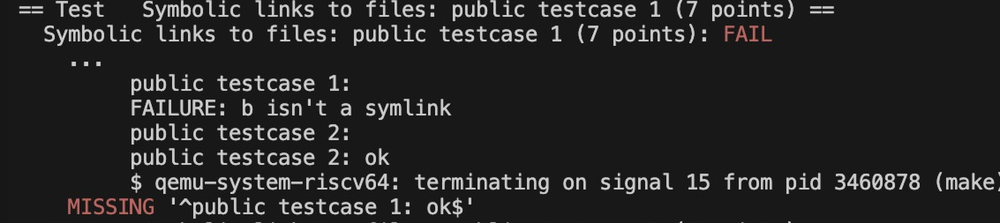
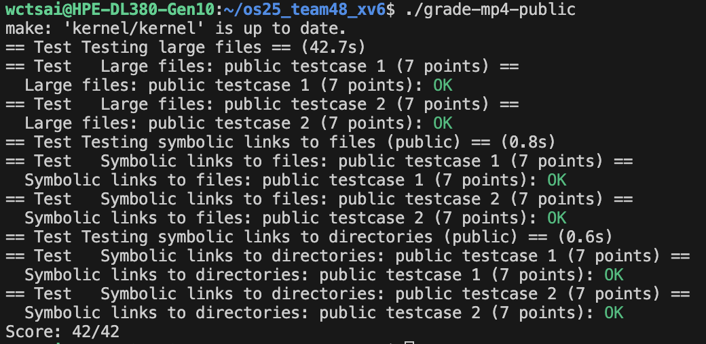

# MP4 report 
  112062527 陳俞靜
  114065501 蔡宛秦

## Table of contents

- [Part 1: Large Files](#part-1-large-file)
  - [Trace Code](#trace-code)
  - [Question](#question)
- [Part 2:  Symbolic Links to Files](#part-2--symbolic-links-to-files)
- [Part 3:  Symbolic Links to Directories](#part-3--symbolic-links-to-directories)
- [Test report](#test-report)
- [Bonus report](#bonus)
- [Contributions](#contributions)

＊註：可點擊藍色文字前往查看詳細資訊

## Part 1: Large File

xv6 裡，資料實際是存在一顆叫 virtio disk 的虛擬硬碟上。磁碟上要有一些結構來記錄，包含 inodes：描述一個檔案 / 目錄的 metadata + block 位址 、bitmap：記哪個 data block 有被用過、superblock：記整個檔案系統的總體資訊。
若遇到 crash recovery 當機或斷電後如何維持資料一致，xv6 用 logging（write-ahead log）不先直接改正式資料結構，先把要做哪些修改寫進 log，確定 log 寫完（commit）之後，再把修改真的套到正式檔案系統，重開機時讀 log，這樣要不是整個操作都不算，就是整個操作都算 (atomic)。
xv6 的 file system 分成七層：
1. Disk layer：最底層用 virtio driver 去讀、寫一個sector 編號
2. Buffer cache layer（`bio.c`）：提供 bread, bwrite, brelse，負責 cache 磁碟 block 的內容，在 struct buf保證同一個 block 同一時間只有一份 buffer，而且只有一個 thread 使用。有一個 bcache，裡面有 lock + 一個雙向 linked list of struct buf，每個 buf 裡有 data存該 block 的內容、valid：資料是否有效(有沒有讀過)、disk是否正在跟 disk 同步中、refcnt目前有幾個使用者
3. Logging layer（`log.c`）：提供 `begin_op()`, `log_write()`, `end_op()`，讓上層可以把一堆 block 修改包成一個 transaction ，保證一次全部寫入，或完全不寫入
4. Inode layer：一個 inode 代表一個檔案（或目錄），有檔案類型（檔案 / 目錄 / 裝置）、檔案大小  block 指標（direct、indirect、之後你要加 double indirect）、函式 iget(), iput()  ilock(), iunlock(),readi(), writei(), bmap()
5. Directory layer ：目錄其實也是一個 inode，內容是一串 directory entries
6. Pathname layer：實作像是 namei("/usr/rtm/xv6/fs.c")，遞迴解析從 root inode 開始，一層一層 dirlookup
7. File descriptor layer：對 application 來說，所有東西看起來都是 fd (檔案、pipe、device)，把這些抽象起來，讓 user program 用統一的 read/write/close 操作

<details>
  <summary><span style="background-color:orange; color:black;">XV6 filesystem</span></summary>
  
  | 名詞                        | 解釋                                | XV6 對應                                    |
  | :------------------------- | :----------------------------------- | :----------------------------------------- |
  | **block**                 | 磁碟上的一格資料（1KB）                       | `BSIZE=1024`                              |
  | **buffer（struct buf）**    | block 在記憶體的版本                       | `struct buf`                              |
  | **inode**                 | 檔案的 metadata，包含：大小、擁有者、data block 的位址：`ip->addrs[]`(一陣列， block number在 xv6 中有 13 個 entries： addrs[0..11] 的12 個 direct blocks、addrs[12] 的 1 個 indirect block 指標) | `struct inode`（記憶體） / `struct dinode`（磁碟） |
  | **bitmap**                | 哪些 block 被使用                        | block allocator                           |
  | **log (write-ahead log)** | 記「將來要修改哪些 block」                    | `log_write`, `begin_op`, `end_op`         |
  | **directory (T_DIR)**     | 特殊 file，裡面是一堆 `(name, inum)`        | `struct dirent`                           |
  | **pathname lookup**       | `/a/b/c` 一層一層找 inode                | `namei`, `dirlookup`                      |
  | **buffer cache**          | block 的快取 + 鎖                       | `bread`, `brelse`                         |
  | **bmap**                  | inode 第 bn 個資料 block → 轉成磁碟 block # | double indirect 在這裡改                      |
  | **itrunc**                | 清掉整個檔案（free 所有 block）               | Part 1 更改處                               |

  - v6 的 inode 有固定大小，只能放有限數量的: direct block pointers（直接指向 data block）、indirect block pointers（間接）
  ```c
            inode (addrs[])
            ┌───────┬───────┬───────┬──────────────┐
            │ D0    │ D1    │ ...   │  IND         │
            └───────┴───────┴───────┴──────────────┘
              │       │               │
              ▼       ▼               ▼
          DataBlk0 DataBlk1       Indirect Block
                                      │
                                      ▼
                      ┌───────── indirect block──────────┐
                      │ a[0] │ a[1] │ a[2] │ ..... a[255] │
                      └────────────────────────────────────┘
                        │       │                     │
                        ▼       ▼                     ▼
                  DataBlk12 DataBlk13           DataBlk(12+255)
  ```
  </details> 

### Trace Code
#### Part A: Writing to a Large File
1. `kernel/sysfile.c/sys_write()`

    `sys_write()` 是系統呼叫接口，處理 user $\to$ kernel 的 write 請求。不做任何寫入，它只是把 user 的參數解析交給 filewrite，是 filesystem 操作的入口

    ```c
    uint64
    sys_write(void)
    {
      struct file *f;
      int n;
      uint64 p;
      // 取出 user 傳入的參數（fd、buffer、size）
      argaddr(1, &p); 
      argint(2, &n);
      if(argfd(0, 0, &f) < 0)
        return -1;

      return filewrite(f, p, n); // 呼叫 filewrite()，檔案的操作都統一由 file 層來處理
    }
    ```

<span id="filewrite"></span>

2. `kernel/file.c/filewrite()`

    處理檔案寫入的邏輯（支援 pipes、devices、inodes 等不同類型）

    | f->type   | 說明                   |
    | --------- | -------------------- |
    | FD_PIPE   | 寫到 pipe              |
    | FD_DEVICE | 寫到 device（如 console） |
    | FD_INODE  | 寫到真正的檔案（inode）       |
    | (其他)      | panic                |


    ```c filewrite() 的流程圖
    filewrite()
    ├─ begin_op()   # 向 log 層預約log 空間
    ├─ ilock(inode) # 上鎖 inode
    ├─ writei()     # 真正的寫入邏輯（Part 1 重點）
    ├─ iunlock()
    └─ end_op()     # 若本系統呼叫結束 → 可能 commit transaction
    ```

    ```c
    int
    filewrite(struct file *f, uint64 addr, int n)
    {
      int r, ret = 0;
      if(f->writable == 0) // 1. 檢查是否可寫
        return -1;
      if(f->type == FD_PIPE){ // 2. 依 f->type 決定寫入方式
        ret = pipewrite(f->pipe, addr, n);
      } else if(f->type == FD_DEVICE){
        if(f->major < 0 || f->major >= NDEV || !devsw[f->major].write)
          return -1;
        ret = devsw[f->major].write(1, addr, n);
      } else if(f->type == FD_INODE){
        int max = ((MAXOPBLOCKS-1-1-2) / 2) * BSIZE; // 3. 若是 inode → 每次最多寫 max bytes
        int i = 0;
        while(i < n){
          int n1 = n - i;
          if(n1 > max)
            n1 = max;

          begin_op(); // (1) 開始一個 log transaction
          ilock(f->ip); // (2) 鎖 inode（避免 race）
          if ((r = writei(f->ip, 1, addr + i, f->off, n1)) > 0) // (3) 寫入 n1 bytes
            f->off += r; // 決定要寫哪些 block、是否需要分配新的 block、是否要使用 indirect/ double-indirect！
          iunlock(f->ip); // (4) 解鎖
          end_op();
          if(r != n1){ // (5) 結束 transaction（可能 commit）
            break;
          }
          i += r;
        }
        ret = (i == n ? n : -1);
      } else {
        panic("filewrite");
      }
      return ret;
    }
    ```

3. `kernel/fs.c/writei()`

    `writei()` 會把 buffer（user 或 kernel）的資料寫入inode 所代表的檔案中， 透過 bmap 找出（需要時分配）資料 block，修改該 block 的內容，並將修改加入 log

    ```c
    offset = 目前寫入位置 f->off
    for(每個要寫入的區塊):
        bmap() 找出對應的 *磁碟 block*
        bread() 讀該 block
        在 bp->data 裡修改資料
        log_write(bp) 讓這次修改加入 transaction
    ```

    ```c
    int
    writei(struct inode *ip, int user_src, uint64 src, uint off, uint n)
    {
      uint tot, m;
      struct buf *bp;

      if(off > ip->size || off + n < off)
        return -1;
      if(off + n > MAXFILE*BSIZE)
        return -1;

      for(tot=0; tot<n; tot+=m, off+=m, src+=m){ // 逐 block 寫入
        uint addr = bmap(ip, off/BSIZE); // bmap() 找出要寫的 block
        // 如果該 block 存在，回傳 block number；不存在就分配新的 disk block，更新 inode 的 direct/indirect block
        if(addr == 0)
          break;
        bp = bread(ip->dev, addr); // 從 disk 讀 block、放到 buffer cache、回傳 struct buf* 
        m = min(n - tot, BSIZE - off%BSIZE); // 計算一次要寫多少資料 (m)。m 不能超過該 block 剩下的空間
        if(either_copyin(bp->data + (off % BSIZE), user_src, src, m) == -1) { // 把資料寫進 block
          brelse(bp);
          break;
        }
        log_write(bp); // log_write() 把 buffer 記錄到 log buffer，標記這個 block 在本 transaction 中被修改
        brelse(bp); // 解鎖 bp，放回 buffer cache（但資料仍在 cache 裡）
      }

      if(off > ip->size) // 若 off 成長就要更新 inode 大小
        ip->size = off;
      iupdate(ip); // 更新 inode metadata

      return tot;
    }
    ```

    - `bread(dev, blockno)` 讀取磁碟的 block 到 buffer cache，並回傳 struct buf (只向該 block 的指標)
      - `struct buf* bp = bread(ip->dev, addr);`

        ```c
        struct buf*
        bread(uint dev, uint blockno)
        {
          struct buf *b;
          b = bget(dev, blockno);
          if(!b->valid) {
            virtio_disk_rw(b, 0);
            b->valid = 1;
          }
          return b;
        }
        ```

4. `kernel/fs.c/bmap()`

    將檔案內第 bn (block number inside the file) 個資料 block 對應到磁碟上的 block 編號。若該 block 尚未分配 $\to$ 分配新的 block
    > `bn` 不是磁碟上的 block number，而是檔案中的第幾個資料區塊 (例：bn=0 是第 1 個資料區塊、bn=5 是第 6 個資料區塊)

    - inode 裡儲存 block 編號的 layout
      - `NDIRECT`：Direct block pointers 數量 12。inode 裡的前 12 個 block 指標稱為 Direct blocks

        12 個 direct blocks + 1 個 indirect block
        ```c
        inode.addrs[] = {
        addrs[0] : direct block
        addrs[1] : direct block
        ...
        addrs[NDIRECT-1]
        addrs[NDIRECT] : single-indirect block pointer
        }
        ```
      - `NINDIRECT`：Indirect block 可以容納的 block 指標數，因每個 block pointer 是 4bytes(uint)，block 是 1024bytes，1024/4 = 256

    - bp->data 裡面包含 256 個 block pointers
      - BSIZE (Block Size) = 1024 bytes (磁碟是以 1KB 為一個 block 的讀寫單位)
      - 每個 block pointer = 4 bytes (uint)
      - 1024 / 4 = 256   → 但 xv6 限制 NINDIRECT = 256


    ```c
    static uint
    bmap(struct inode *ip, uint bn)
    {
      uint addr, *a1, *a2; // ADD *a1, *a2
      struct buf *bp, *bp2; // ADD *bp2

      if(bn < NDIRECT){ // 1. direct blocks
        if((addr = ip->addrs[bn]) == 0){
          addr = balloc(ip->dev);
          if(addr == 0)
            return 0;
          ip->addrs[bn] = addr;
        }
        return addr;
      }
      bn -= NDIRECT; 

      if(bn < NINDIRECT){ // 2. single-indirect blocks
        // Load indirect block, allocating if necessary.
        if((addr = ip->addrs[NDIRECT]) == 0){
          addr = balloc(ip->dev);
          if(addr == 0)
            return 0;
          ip->addrs[NDIRECT] = addr;
        }
        bp = bread(ip->dev, addr);
        a1 = (uint*)bp->data;
        if((addr = a1[bn]) == 0){
          addr = balloc(ip->dev);
          if(addr == 0){
            brelse(bp); // ADD
            return 0;
          }
          a1[bn] = addr;
          log_write(bp);
        }
        brelse(bp);
        return addr;
      }
      // ADD
      bn -= NINDIRECT;
      if(bn < 2 * NINDIRECT * NINDIRECT){
        uint dbl   = bn / (NINDIRECT * NINDIRECT);   // 第幾個 double indirect (0 or 1)
        uint rem   = bn % (NINDIRECT * NINDIRECT);
        uint first = rem / NINDIRECT;                // 第一層 index
        uint second= rem % NINDIRECT;                // 第二層 index

        uint dbl_index = NDIRECT + 1 + dbl;          // addrs[11] or addrs[12]

        /* allocate/load double-indirect block */
        if((addr = ip->addrs[dbl_index]) == 0){
          addr = balloc(ip->dev);
          if(addr == 0)
            return 0;
          ip->addrs[dbl_index] = addr;
        }

        bp = bread(ip->dev, addr);
        a1 = (uint *)bp->data;

        /* allocate/load 2nd-level indirect block */
        uint addr2;
        if((addr2 = a1[first]) == 0){
          addr2 = balloc(ip->dev);
          if(addr2 == 0){
            brelse(bp);
            return 0;
          }
          a1[first] = addr2;
          log_write(bp);
        }
        brelse(bp);

        /* allocate/load data block */
        bp2 = bread(ip->dev, addr2);
        a2 = (uint *)bp2->data;

        if((addr = a2[second]) == 0){
          addr = balloc(ip->dev);
          if(addr == 0){
            brelse(bp2);
            return 0;
          }
          a2[second] = addr;
          log_write(bp2);
        }

        brelse(bp2);
        return addr;
      }
      return 0;
      // panic("bmap: out of range");
    }
    ```

    <details>
      <summary><span style="background-color:orange; color:black;">`balloc(dev)`, `brelse(*b)`, `log_write()`</span></summary>

      - `balloc(dev)` 
      
          在磁碟上分配新的空 block。他會找磁碟上哪個 block 沒有備用 (bitmap = 0)，把他設定為 1(已使用)、清空、回傳此 block 的 block number

          ```c
          static uint
          balloc(uint dev)
          {
            int b, bi, m;
            struct buf *bp;
            bp = 0;
            for(b = 0; b < sb.size; b += BPB){
              bp = bread(dev, BBLOCK(b, sb));
              for(bi = 0; bi < BPB && b + bi < sb.size; bi++){
                m = 1 << (bi % 8);
                if((bp->data[bi/8] & m) == 0){  // Is block free?
                  bp->data[bi/8] |= m;  // Mark block in use.
                  log_write(bp);
                  brelse(bp);
                  bzero(dev, b + bi);
                  return b + bi;
                }
              }
              brelse(bp);
            }
            printf("balloc: out of blocks\n");
            return 0;
          }
          ```
    - `brelse(*b)` 
    
      釋放 buffer，讓它可以被 cache 回收

      > buffer cache 是一個 雙向鏈結串列（LRU）: `head <-> b1 <-> b2 <-> ... <-> bn`
      > `refcnt`：代表有幾個使用者正在使用這個 buffer

        ```c
        void
        brelse(struct buf *b)
        {
          if(!holdingsleep(&b->lock)) // 確保持有睡眠鎖，每個 buffer 有自己的sleep lock，只要有人在用這個 buffer，它就應該被鎖，呼叫 brelse 的人一定應該持有該 buffer 鎖
            panic("brelse");
          releasesleep(&b->lock); // 釋放 buffer 的 sleep lock (不再操作這塊資料了)
          acquire(&bcache.lock); // 鎖住整個 buffer cache (避免 race condition)
          b->refcnt--; // refcnt > 0 表 buffer 正在被某個 process 使用；refcnt = 0 表 buffer 可供未來重新使用
          if (b->refcnt == 0) { // 若沒人在用就放回 LRU
            b->next->prev = b->prev; // 先把 b 從目前鏈結串列位置拔掉
            b->prev->next = b->next; 
            b->next = bcache.head.next; // 再把它插入 head 後面（LRU 最前端），放在 head 後面代表最近可用，之後找 free buffer 時它會是優先選項
            b->prev = &bcache.head;
            bcache.head.next->prev = b;
            bcache.head.next = b;
          }
          release(&bcache.lock);
        }
        ```
    - `log_write()`

        xv6 使用 write-ahead logging（WAL）。告訴系統：buffer 被修改過，之後要寫進 log、做 log absorption (避免重複寫入相同 block)、pin buffer（避免被回收直到 transaction 完成）

        - log 結構 (簡化)

            ```c
            struct {
              struct spinlock lock;
              int size;         // 整體 log 區大小
              int outstanding;  // 目前還有幾個 active transaction
              struct logheader {
                int n;               // 修改過 block 的數量
                int block[LOGSIZE];  // 修改的 block 編號
              } lh;
            } log;
            ```
        - Log Absorption：如果某個 block 已經在 log 中，就不需要再次加入、只要 break 就好

            ```c
            void
            log_write(struct buf *b)
            {
              int i;

              acquire(&log.lock); // 鎖住 log 系統，log header 是共享全域資源！！
              if (log.lh.n >= LOGSIZE || log.lh.n >= log.size - 1) // 檢查 log 空間是否不足
                panic("too big a transaction");
              if (log.outstanding < 1) // 檢查是否在 transaction 內，log_write 必須出現在更新 buffer
                panic("log_write outside of trans");

              for (i = 0; i < log.lh.n; i++) { // Log Absorption 避免重複記錄同一個 block
                if (log.lh.block[i] == b->blockno)   // log absorption
                  break;
              }
              log.lh.block[i] = b->blockno; // 紀錄該 block 至 log header
              if (i == log.lh.n) {  // 如果是新的 block 就加入 transaction
                bpin(b); // bpin 會讓 buffer 的 refcnt++，直到 transaction commit 才能釋放
                log.lh.n++; // 代表這筆交易中又多了一個需要寫入日誌的 block
              }
              release(&log.lock);
            }
            ```
    </details>

#### Part B: Deleting a Large File

- 觸發流程：user space `$ rm bigfile`，rm 最後會呼叫系統呼叫 `unlink("bigfile");`

    ```c
    unlink("bigfile")  (libc)
      ↓ ecall
    sys_unlink()       (kernel/sysfile.c)
      ↓
    ...
      ↓
    itrunc() + iput()
    ```

  - 刪檔案xv6是：
    - 從目錄裡把名字刪掉（unlink）：把 dirent 裡的 inum 清成 0、讓 inode 的 nlink--（被幾個檔名指到）  
    - 當 inode 不再被任何目錄指向，且記憶體中也只剩這一個引用時，`iput()` 會呼叫 `itrunc()` 把所有 data blocks free 掉、把 `inode.type = 0`，代表這個 inode slot 也可以重用

1. `kernel/sysfile.c/sys_unlink()`

    從目錄中移除某個名稱對 inode 的 directory entry，然後將 inode 的連結數（nlink）-1

    > dp = parent directory 的 inode（directory parent）
    > ip = target 檔案 / 目錄的 inode（inode of path）

    ```c
    uint64
    sys_unlink(void)
    {
      struct inode *ip, *dp;
      struct dirent de;
      char name[DIRSIZ], path[MAXPATH];
      uint off;

      if(argstr(0, path, MAXPATH) < 0) // 讀取 user 傳進來的字串參數 path，0 表示第 0 個系統呼叫參數
        return -1; // 從 user space 取出字串，放到 kernel 的 char path[MAXPATH] 裡

      begin_op(); // 開一個 transaction（log）// 宣告我要開始做一個會修改檔案系統的操作
      if((dp = nameiparent(path, name)) == 0){ // 找到父目錄與檔名
        end_op();
        return -1;
      }

      ilock(dp); // 鎖住父目錄 inode，確保接下來讀 / 改 dp 的內容（目錄 entries）時不會有 race
      // . 代表目前目錄自己、.. 代表父目錄，刪掉它們會讓目錄樹不完整，系統會壞掉
      if(namecmp(name, ".") == 0 || namecmp(name, "..") == 0) // 不讓刪掉 "." 或 ".."
        goto bad;

      if((ip = dirlookup(dp, name, &off)) == 0) // 在 dp 裡找到要刪的 entry
        goto bad;
      ilock(ip); // 針對 target inode 上鎖，讀寫安全

      if(ip->nlink < 1) // 檢查 inode 的 link count 是否合理 + 目錄是否為空
        panic("unlink: nlink < 1"); 
      if(ip->type == T_DIR && !isdirempty(ip)){ // 表是要 unlink 的是一個目錄，且它裡面還有其他 entry（不只 . 和 ..）  
        iunlockput(ip); // xv6 不允許刪掉非空目錄，所以呼叫 iunlockput(ip) 把 inode 的鎖 & ref 都釋放掉
        goto bad;
      }

      memset(&de, 0, sizeof(de)); // 真正從目錄刪掉檔名
      if(writei(dp, 0, (uint64)&de, off, sizeof(de)) != sizeof(de)) // 準備一全 0 的 struct dirent de（inum = 0,name = ""），用 writei(dp, ...) 寫回目錄檔案中的 offset
        panic("unlink: writei");
      if(ip->type == T_DIR){ // 若刪的是目錄，要更新父目錄的 nlink
        dp->nlink--;
        iupdate(dp);
      }
      iunlockput(dp);

      ip->nlink--; // 將 inode 的連結數-1。 如果 nlink＝0，後續才有機會把檔案內容刪掉
      iupdate(ip); // ip 的 metadata（含新的 nlink）寫回磁碟
      iunlockput(ip); // 釋放鎖
      end_op(); // 如果沒有其他 FS 系統呼叫在進行，end_op() 會執行 commit：把這次 unlink 相關改動全部寫入 log
      return 0;

    bad: // 發生錯誤的情況
      iunlockput(dp); // 釋放父目錄的 inode
      end_op(); // 結束 transaction
      return -1;
    }
    ```

    <details>
      <summary><span style="background-color:orange; color:black;">`dirlookup(dp, name, &off)`</span></summary>

      `dirlookup(dp, name, &off)`在目錄 dp 的內容（目錄 entries）內掃描每個 `struct dirent { ushort inum; char name[DIRSIZ]; }`，找到 name時回傳對應的 inode $\to$ ip，用 `*off` 回傳該 entry 在目錄檔案內的 byte offset。ip 就是 要被 unlink 的那個 inode

      ```c
      struct inode*
      dirlookup(struct inode *dp, char *name, uint *poff)
      {
        uint off, inum;
        struct dirent de;

        if(dp->type != T_DIR)
          panic("dirlookup not DIR");

        for(off = 0; off < dp->size; off += sizeof(de)){
          if(readi(dp, 0, (uint64)&de, off, sizeof(de)) != sizeof(de))
            panic("dirlookup read");
          if(de.inum == 0)
            continue;
          if(namecmp(name, de.name) == 0){
            // entry matches path element
            if(poff)
              *poff = off;
            inum = de.inum;
            return iget(dp->dev, inum);
          }
        }

        return 0;
      }
      ```
    </details>


2. `kernel/fs.c/iunlockput()/iput()` 

    - `kernel/fs.c/iunlockput()`

      inode 改完了要解鎖 + 釋放引用

      ```c
      void
      iunlockput(struct inode *ip) 
      {
        iunlock(ip);
        iput(ip); // 判斷是不是該真的刪掉這個 inode
      }
      ```

    - `kernel/fs.c/iput()`
      - `ip->ref`: in-memory inode 的引用次數 (有幾個 C 指標指向這個 struct inode)，僅存在於記憶體
      - `ip->nlink`: 磁碟上 inode 的 link 數，有幾個 directory entry 指向它，由 `link()` / `unlink()` 改變
      - `ip->valid`: in-memory inode 是否已經從磁碟讀入過對應的 on-disk inode
      - `itable.lock`: 保護整個 inode table 的 lock，確保`ip->ref` 正確，不會有同一個 inode 被插入 inode table 兩次
      - `ip->lock`: inode 專屬的鎖，保護此 inode 的 metadata 和內容讀寫

      iput 是丟掉對 inode 的一個引用，若發現on-disk 沒有任何目錄 entry (nlink==0)、in-memory 也僅剩這一個引用（ref==1），它就會呼叫 itrunc 釋放檔案內容，並把 inode slot 也標記為 free。

      ```c
      void
      iput(struct inode *ip)
      {
        acquire(&itable.lock); // 上 itable.lock 保護 inode table
        if(ip->ref == 1 && ip->valid && ip->nlink == 0){ // 檢查是否符合可以刪掉檔案的條件
          // ref 只有呼叫的此 iput() 還持有 inode 的指標, valid 資料是有效的, nlink 不再被任何目錄 entry 指向
          acquiresleep(&ip->lock); // ref==1，代表沒人會跟我搶 lock → 直接 acquiresleep
          release(&itable.lock);

          itrunc(ip); // 真正刪檔案內容：itrunc(ip)
          ip->type = 0; // on-disk inode slot 變成 free
          iupdate(ip); // 把這個 inode（type = 0, size = 0 等）寫回磁碟
          ip->valid = 0; // 記憶體中這份 inode 的內容不再與磁碟同步了
          releasesleep(&ip->lock); // 釋放 inode 自己的 lock
          acquire(&itable.lock);
        }
        ip->ref--;
        release(&itable.lock);
      }
      ```

3. `kernel/fs.c/itrunc()`

    把 inode 的所有內容（data blocks）通通 free 掉， 只留下空的 inode（type & metadata 還在，由 iput 之後更改為 0）
    > 前提：caller 必須已經對 ip 上鎖（ilock）(在 iput 裡有做：`acquiresleep(&ip->lock)`)

    - `ip->addrs[]`：檔案用到的 block 編號
    - `bfree(dev, bno)`：在 bitmap 中把 block 編號 bno 標成 free
    - `bread(dev, bno)`, `brelse(bp)`：從 disk 把某個 block 讀入 buffer cache，用完釋放 buffer

    ```c
    void
    itrunc(struct inode *ip)
    {
      int i, j;
      struct buf *bp;
      uint *a;

      for(i = 0; i < NDIRECT; i++){
        if(ip->addrs[i]){ // ip->addrs[i]!= 0 表示這個 direct block 有被用過
          bfree(ip->dev, ip->addrs[i]); // bfree改 bitmap，把這個 block 標為未使用
          ip->addrs[i] = 0; // 避免 dangling pointer
        }
      }
      // 處理 single-indirect
      if(ip->addrs[NDIRECT]){ // 表有一個 indirect block
        bp = bread(ip->dev, ip->addrs[NDIRECT]);
        a = (uint*)bp->data;
        for(j = 0; j < NINDIRECT; j++){
          if(a[j])
            bfree(ip->dev, a[j]);
        }
        brelse(bp); // 釋放 buffer
        bfree(ip->dev, ip->addrs[NDIRECT]); // 把 indirect block 本身也 free 掉
        ip->addrs[NDIRECT] = 0;
      }

      ip->size = 0;
      iupdate(ip); // 把 this inode 的 metadata 寫回 disk
    }
    ```

### Question
#### Q1. What is the current maximum file size xv6 can support? How many numbers of direct and indirect blocks are there?

xv6 inode 的 addrs[] 結構包含：12 個 direct block pointers(`NDIRECT = 12`)、1 個 single-indirect block pointer(`addrs[NDIRECT]`)，且single-indirect block 內可存放 1024 / 4 = 256 個 data block pointers。因此，一個檔案最多可使用的 data blocks 數量為：12 (direct) + 256 (single-indirect) = 268 blocks
每個 block 大小為 1024 bytes，因此最大檔案大小約為 268 × 1024 &asymp; 268 KB

#### 2. How many blocks increase when replacing a direct block with a doubly-indirect block?

一個 direct block pointer 只能指向 1 個 data block、而一個 doubly-indirect block pointer 可以指向 256 個 single-indirect blocks 每個 single-indirect block 再指向 256 個 data blocks：256 × 256 = 65536 個 data blocks  
因此用一個 doubly-indirect block 取代一個 direct block，可增加的 data blocks 數量為  65536 − 1 = 65535 個 data blocks

#### 3. The `bmap` and `itrunc` functions make use of the buffer cache via `bread`, `brelse`, and `log_write`. Explain the above function.

`bmap()`, `itrunc()` 需要操作磁碟上的 metadata（如 indirect blocks、bitmap），這些操作都透過 buffer cache 進行

- `bread(dev, blockno)`: 從磁碟讀取指定 block 到 buffer cache，回傳一個已上鎖（sleep-lock）的 `struct buf *`，呼叫者可直接存取 bp->data
- `brelse(bp)`: 釋放 buffer 的 sleep-lock，告知 buffer cache 該 buffer 已使用完畢、允許 buffer 被其他 process 使用或回收 
 - `log_write(bp)`: 宣告該 buffer 已被修改、將 block 記錄到目前的 transaction log 中、確保該 block 在 commit 前不會被寫回原位置或被 evict、使修改具備 crash safety  

在 `bmap()` 中，當 indirect 或 doubly-indirect block 被更新時，必須呼叫 `log_write()`； 在 itrunc() 中，釋放 blocks 前後同樣需要透過 log 確保一致性

#### 4. Explain the importance of calling `brelse` after you are done with a buffer from `bread`. 

`bread()` 會回傳一個已被鎖住的 buffer。如果使用完 buffer 後未呼叫 `brelse()`，將造成
1. Buffer cache 資源耗盡，buffer 無法被回收或重複使用，最終導致系統 panic（"no buffers"）  
2. Deadlock，其他 process 嘗試存取同一 block 時會永久阻塞
3. 破壞 LRU 快取策略，buffer 無法正確標記為最近使用 

#### 5. To ensure crash safety, xv6 uses a write-ahead log. Trace the lifecycle of a file system transaction, for example when creating a new file via `create()` in `kernel/fs.c`. Explain the roles of `begin_op()`, `log_write()`, and `end_op()` from `kernel/log.c`. Describe what gets written to the on-disk log and what constitutes a "commit". Finally, explain how the recovery code (`recover_from_log`) uses the log to ensure the operation is atomic after a crash. We strongly encourage you to read the logging part(8.4) in xv6 handbook to get familiar with loggin mechanism.

若是建立新檔案，系統呼叫流程：
```c
sys_open() → create() → ialloc() / dirlink() / iupdate()
```
- `begin_op()`: 等待目前是否有 commit 正在進行、檢查 log 剩餘空間是否足夠、將 system call 納入目前 transaction、防止 commit 在 system call 尚未結束前發生
- `log_write(bp)`: 每當 metadata block（inode、bitmap、directory block）被修改時呼叫，將該 block 的 block number 記錄在記憶體中的 log header、確保修改在 commit 前不會直接寫回原磁碟位置，同一個 block 多次寫入會被 absorption 成一筆 log entry
- `end_op()`: 系統呼叫結束，遞減 outstanding system calls 數量，若目前為最後一個 system call，觸發 commit。commit 流程會將修改過的 blocks 寫入 log 區、寫入 log header（為 commit point）、將 log 中的 blocks 套用回真正的檔案系統位置、清空 log header 
- `recover_from_log`(Crash Recovery): 系統開機時執行，若 log header 顯示有已 commit 的 transaction，會將 log 中的 blocks 重新寫回檔案系統，若 log header 為空，就忽略 log，確保 transaction 要嘛完全完成，要嘛完全沒發生

#### 6. Explain the roles of the in-memory inode functions `iget()` and `iput()`. Describe the purpose of the reference count (`ref`) in `struct inode`.

- `iget(dev, inum)`: 從 inode table 取得指定 inode 的 in-memory 表示，若 inode 已存在於記憶體中，增加 ref。若不存在，配置新的 inode table entry 並初始化、回傳的 inode 未上鎖
- `iput(ip)`: 釋放一個 inode 的 in-memory reference，將 ref 減 1。若 `ref == 1`, `nlink == 0`, `inode 為 valid`，則呼叫 `itrunc()` 釋放所有 data blocks，將 inode 標記為 free、寫回磁碟
- `ref` (reference count): ref 表示目前有多少 kernel pointers 正在使用該 inode，例如開啟中的 file descriptor、current working directory、pathname lookup 過程中的暫時引用。ref 的存在確保inode 不會在仍被使用時被釋放、多個 process 可安全共享同一 inode、inode 的生命週期與實際使用狀態一致


#### Implementation

1. `kernel/fs.h`:實際寫到磁碟上的檔案系統結構

    inode 結構不變，`addrs` 長度仍然是 13（`NADDR = 13`），MAXFILE 也要更新讓 writei 裡的檢查符合新上限

    ```c
    addrs[0...9]   → direct
    addrs[10]     → single indirect
    addrs[11]     → double indirect
    addrs[12]     → double indirect
    ```

    ```c
    #define NDIRECT   10
    #define NINDIRECT (BSIZE / sizeof(uint))   // 256
    #define NADDR     13                       // inode addrs[] 固定 13

    #define MAXFILE (NDIRECT + NINDIRECT + 2 * NINDIRECT * NINDIRECT)
    ```


2. `kernel/file.h`:in-memory inode 與 file descriptor

    讓 on-disk inode（dinode）與 in-memory inode（inode）保持一致。否則可能會從 disk 讀進 inode 時資料錯位

    ```c
    // in-memory copy of an inode
    struct inode {
      uint dev;           // Device number
      uint inum;          // Inode number
      int ref;            // Reference count
      struct sleeplock lock; // protects everything below here
      int valid;          // inode has been read from disk?

      short type;         // copy of disk inode
      short major;
      short minor;
      short nlink;
      uint size;
      // uint addrs[NDIRECT+1]; // TODO: bigfile. If you modify dinode, don't forget here.
      uint  addrs[13];   // ADD same layout as on-disk dinode
    };
    ```

3. `kernel/fs.c`:真正實作檔案怎麼用 block的地方


    ```c
    // Convenient indices into ip->addrs[].
    #define SINDIRECT   (NDIRECT)          // index of single-indirect block
    #define DINDIRECT0  (NDIRECT + 1)      // first doubly-indirect root
    // second doubly-indirect root = DINDIRECT0 + 1
    ```
    - `bmap(struct inode *ip, uint bn)`:新增第三層 mapping

      要計算  bn 對應：第幾層doubly-indirect index、single-indirect index。用到才配置 block（lazy allocation）、每次修改 metadata block 一定 `log_write()`

      ```c
      static uint
      bmap(struct inode *ip, uint bn)
      {
        uint addr, *a1, *a2; // ADD *a1, *a2
        struct buf *bp, *bp2; // ADD *bp2

        if(bn < NDIRECT){ // 1. direct blocks
          if((addr = ip->addrs[bn]) == 0){
            addr = balloc(ip->dev);
            if(addr == 0)
              return 0;
            ip->addrs[bn] = addr;
          }
          return addr;
        }
        bn -= NDIRECT; 

        if(bn < NINDIRECT){ // 2. single-indirect blocks
          // Load indirect block, allocating if necessary.
          if((addr = ip->addrs[NDIRECT]) == 0){
            addr = balloc(ip->dev);
            if(addr == 0)
              return 0;
            ip->addrs[NDIRECT] = addr;
          }
          bp = bread(ip->dev, addr);
          a1 = (uint*)bp->data;
          if((addr = a1[bn]) == 0){
            addr = balloc(ip->dev);
            if(addr){
              a1[bn] = addr;
              log_write(bp);
            }
          }
          brelse(bp);
          return addr;
        }
        // ADD
        bn -= NINDIRECT;
        // 3. doubly-indirect blocks // ADD
        // 3) double indirect blocks
        if(bn < NINDIRECT * NINDIRECT){
          uint first = bn / NINDIRECT;   // 第幾個「第二層indirect」
          uint second = bn % NINDIRECT;  // 在第二層indirect裡的第幾個entry

          // 3-1) allocate/load double indirect block
          if((addr = ip->addrs[NDIRECT+1]) == 0){
            addr = balloc(ip->dev);
            if(addr == 0)
              return 0;
            ip->addrs[NDIRECT+1] = addr;
          }

          bp = bread(ip->dev, addr);
          a1 = (uint*)bp->data;

          // 3-2) allocate/load 2nd-level indirect block
          uint addr2;
          if((addr2 = a1[first]) == 0){
            addr2 = balloc(ip->dev);
            if(addr2 == 0){
              brelse(bp);
              return 0;
            }
            a1[first] = addr2;
            log_write(bp);   // double-indirect block changed
          }
          brelse(bp);

          // 3-3) allocate/load data block via 2nd-level indirect
          bp2 = bread(ip->dev, addr2);
          a2 = (uint*)bp2->data;
          if((addr = a2[second]) == 0){
            addr = balloc(ip->dev);
            if(addr == 0){
              brelse(bp2);
              return 0;
            }
            a2[second] = addr;
            log_write(bp2);  // 2nd-level indirect block changed
          }
          brelse(bp2);
          return addr;
        }

        panic("bmap: out of range");
      }
      ```

    - `itrunc(struct inode *ip)`

      完整釋放三層 block。要多做走訪 doubly-indirect block，逐一釋放 second-level single-indirect blocks、data blocks、doubly-indirect root block

      ```c
      // Truncate inode (discard contents).
      // Caller must hold ip->lock.
      void
      itrunc(struct inode *ip)
      {
        int i, j;
        struct buf *bp, *bp2; // ADD *bp2
        uint *a, *a2; // ADD *a2

        for(i = 0; i < NDIRECT; i++){ // 1. free direct blocks
          if(ip->addrs[i]){
            bfree(ip->dev, ip->addrs[i]);
            ip->addrs[i] = 0;
          }
        }

        if(ip->addrs[NDIRECT]){ // 2. free single-indirect blocks
          bp = bread(ip->dev, ip->addrs[NDIRECT]);
          a = (uint*)bp->data;
          for(j = 0; j < NINDIRECT; j++){
            if(a[j])
              bfree(ip->dev, a[j]);
          }
          brelse(bp);
          bfree(ip->dev, ip->addrs[NDIRECT]);
          ip->addrs[NDIRECT] = 0;
        }

        // 3. free doubly-indirect blocks // ADD
        if(ip->addrs[NDIRECT + 1]){
          bp = bread(ip->dev, ip->addrs[NDIRECT + 1]);
          a = (uint*)bp->data;

          for(i = 0; i < NINDIRECT; i++){
            if(a[i]){
              bp2 = bread(ip->dev, a[i]);
              a2 = (uint*)bp2->data;
              for(j = 0; j < NINDIRECT; j++){
                if(a2[j])
                  bfree(ip->dev, a2[j]);
              }
              brelse(bp2);
              bfree(ip->dev, a[i]);
            }
          }

          brelse(bp);
          bfree(ip->dev, ip->addrs[NDIRECT + 1]);
          ip->addrs[NDIRECT + 1] = 0;
        }

        ip->size = 0;
        iupdate(ip);
      }
      ```

## Part 2:  Symbolic Links to Files

Symbolic link 以「路徑字串」指向另一個檔案，因此當使用者呼叫 open() 開啟 symlink 時，kernel 必須 依據 symlink 內容的 pathname 去找到實際目標檔案。

`sysfile.c`

- sys_symlink()：承接 Part 1 我們看到 [filewrite](#filewrite) 的 transaction 概念，把 target path 字串寫入 inode 的 data blocks，會修改磁碟上的檔案系統結構，所以必須把這段修改包在一個 begin_op() / end_op() 的 log transaction 裡。如：symlink() 內部呼叫 create() 與 writei() 。

    ```c
    uint64
    sys_symlink(void)
    {
      // TODO: symbolic link
      // You should implement this symlink system call.
      char target[MAXPATH], path[MAXPATH];
      // int fd;
      // struct file *f;
      struct inode *ip;

      if(argstr(0, target, MAXPATH) < 0 || argstr(1, path, MAXPATH) <     0)
         return -1;

      // --- 實作 symlink：store target path ---
      begin_op(); // 開一個 transaction（log）

      // 建立新的 inode。在檔案系統裡建立一個新的檔名 path
      // 其 inode 類型是 T_SYMLINK，後兩參數是T_DEVICE用->設 0
      ip = create(path, T_SYMLINK, 0, 0);

      if(ip == 0) { // create 失敗
        end_op();
        return -1;
      }

      // 將 target 路徑寫入 inode 的 data block
      // writei(inode, 0是 kernel mem, target字串的addr , symlink內容放0位, 字串長包含 \0)
      if(writei(ip, 0, (uint64)target, 0, strlen(target) + 1) < 0) {
        iunlockput(ip); // create() 內部有 ilock(ip)
        end_op();
        return -1;
      }2

      iunlockput(ip); // 解鎖並釋放 inode
      end_op();   // 結束交易
      // --- 實作 symlink：store target path 結束---

      return 0;
    }
    ```
- `sys_open()`：修改以支援 symbolic link
  - 未指定 O_NOFOLLOW 時遞迴展開 symlink
  - 指定 O_NOFOLLOW 則遇到 symlink 回傳 -2
  - 限制展開深度為 5，避免循環（回傳 -3）

  ```c
  uint64
  sys_open(void)
  {
    char path[MAXPATH];
    ... // 初始化參數、取得參數與 begin_op

    begin_op();

    if(omode & O_CREATE){
      ... // create 邏輯
    } else {
    
      // --- Resolve symbolic links (up to depth 5) ---

      int depth = 0;
      char target[MAXPATH]; // 暫存 symlink 內容，指向的 target     pathname

      while(depth < 5) {    // max 5 level 避免 cycle
        if((ip = namei(path)) == 0){  // 把 path 解析成 inode
          end_op(); // 找不到 end_op, -1返回
          return -1;
        }

      ilock(ip);    // 鎖住 inode，避免race condition，安全讀取後續

      if(ip->type == T_DIR && omode != O_RDONLY){ // if 目錄 且 read    only -> 非法
        iunlockput(ip);
        end_op();
        return -1;
      }
      if(ip->type == T_SYMLINK ) {
        if(omode & O_NOFOLLOW) {  // 處理 O_NOFOLLOW，返回 -2
          iunlockput(ip);
          end_op();
          return -2;
        }
        if(readi(ip, 0, (uint64)target, 0, MAXPATH) <= 0) { // 從     ip 這個 inode 的檔案內容 從 offset 0 開始讀最多 MAXPATH bytes，放   到 kernel 的 target[] 裡。 
          iunlockput(ip);
          end_op();
          return -1;
        }
        int len = ip->size; // 確保 null-terminated
        if(len >= MAXPATH) len = MAXPATH - 1;
        target[len] = '\0';

        iunlockput(ip);

        safestrcpy(path, target, MAXPATH);  // 把 path 更新成     target，下一輪用新路徑再 namei()。
        depth++;
        continue;
        }
        break;  // 不是符號連結，跳出迴圈
      }

      if(depth >= 5) {  // 是否超過深度限制
        if(ip) iunlockput(ip);
        end_op();
        return -3;
      }
    }
    // --- Resolve symbolic links (end) ---

    if(ip->type == T_DEVICE && (ip->major < 0 || ip->major >= NDEV))
      ... // 驗證裝置
    if((f = filealloc()) == 0 || (fd = fdalloc(f)) < 0)
      ... // 分配資源
    if(ip->type == T_DEVICE){
      ...}
    ... // 初始化狀態

    if((omode & O_TRUNC) && ip->type == T_FILE)
    ... // 截斷檔案
    ... // 釋放鎖
    return fd;
  }

  ```

## Part 3:  Symbolic Links to Directories
directory symlink 的正確處理位置應位於 pathname lookup 層，也就是 fs.c 的 namex()（被 namei()/nameiparent() 等共用）。

- `fs.c/namex()`：路徑解析支援目錄 symlink
  - 路徑中遇到 symlink 即展開並繼續解析，
  - 限制總展開次數為 5 以避免循環。
  ```c
  static struct inode*
  namex(char *path, int nameiparent, char *name)
  {
    // TODO: Symbolic Link to Directories
    
    ... // 初始化參數，判斷是否為絕對路徑並處理
  
    // 從 path 取出下一個路徑片段放進 name，回傳 -> 剩下的path指標，或0（走 完了）
    while((path = skipelem(path, name)) != 0){  
      ... // skipelem() 對每一段在當前目錄 inode 上用 dirlookup() 找下一  層 inode
          // 若 nameiparent 則在最後一段前停下並回傳父目錄。
      iunlockput(ip); // 到底時：解鎖並ref--，接下來把 next 當成新的 ip   繼續走下一層
  
      // --- 處理 Symbolic Link 展開 ---
      ilock(next); 
      while(next->type == T_SYMLINK && *path != '\0'){ 
        // 只在路徑中間 component 遇到連結時才展開 (例如 /link/file)
        // 若已是最後一個 component (path 為空)，則不在此展開，交由 sys_open 決定是否 follow
        if(depth >= 5) {  // 超過限制，return 0-> 上層 syscall 變 -1
          iunlockput(next);
          return 0;
        }
        depth++;
  
        char target[MAXPATH];
        // 每次遇到一個 symlink，就用 readi() 把 symlink inode 內存的   target 路徑字串，讀進target[]
        if(readi(next, 0, (uint64)target, 0, next->size) !=   next->size) {
          iunlockput(next);
          return 0;
        }
        target[next->size] = '\0';
        iunlockput(next);
        
        if (target[0] != '/') { // 非絕對路徑，返回 0
          return 0;}
        
        if((next = namei(target)) == 0){  // 新的 target 路徑重新做   pathname lookup
          return 0;}
  
        ilock(next);  // 鎖住，若還是symlink -> while loop
      }
      iunlock(next);
      ip = next;
    }
    // --- 處理 Symbolic Link 展開結束 ---
    if(nameiparent){
      iput(ip);
      return 0;
    }
    return ip;
  }
  ```
<details>
  <summary><span >flow chart(可展開)</span></summary>

  ```
  namex(path, nameiparent, name)

  [初始化]
    depth = 0
    ip = (絕對路徑) ? ROOT : CWD
        ⭣
  ┌─────────────────────────────┐
  │ 外層：逐段解析路徑 skipelem    │
  └─────────────────────────────┘
        ⭣
    鎖 ip ⭢ 檢查是否為目錄 ⭢ N ⭢ 失敗 return 0
        ⭣ Y
    nameiparent && 到最後一段？ ⭢ Y ⭢ return ip (父目錄)
        ⭣ N
    next = dirlookup(ip, name) ⭢ Not found ⭢ 失敗 return 0
        ⭣ found
    釋放 ip, 鎖 next
        ⭣
  ┌─────────────────────────────┐
  │ 內層：展開 symbolic link      │
  └─────────────────────────────┘
        ⭣
    while (next 是 symlink，且不是最後一個 component)
        ⭣
        depth >= 5 ⭢ cycle！return 0
        ⭣
        depth++, 讀取 target 路徑
        ⭣
        非絕對路徑 ⭢ return 0
        ⭣
        next = namei(target) ⭢ fail ⭢ return 0
        ⭣ succes
        │ 
        │⭢   (若仍是 symlink ⭢ 繼續迴圈)
        │ 不是 symlink
        ⭣
    ip = next
        ⭣
        ↳ 回到外層迴圈

  [結束]
    nameiparent？
    ├─ 是 ⭢ iput(ip), return 0
    └─ 否 ⭢ return ip
  ```

</details>

<details>
        <summary><span >failed condition(可展開)</span></summary>
      
      失敗情況：
      1. 路徑元件不是目錄 → return 0
      2. 在目錄中找不到名稱 → return 0
      3. 符號連結深度 >= 5 → return 0 (防止循環)
      4. 讀取符號連結失敗 → return 0
      5. 符號連結不是絕對路徑 → return 0
      6. namei 解析失敗 → return 0
  
      成功情況：
      - nameiparent == 0 → return 最終的 inode
      - nameiparent == 1 → return 0 (已經設置父目錄)
  
  </details>  
<br>

`sysfile.c/sys_chdir()`：用來切換行程目前的工作目錄（cwd）的系統呼叫

 > 本次實作中，我們並未修改 `sys_chdir()`，而是直接將 `symbolic link` 的展開邏輯已統一實作於`Pathname layer`：`kernel/fs.c/namex()`中。\
當`sys_chdir(path)`呼叫`namei(path)`時，若路徑中包含指向目錄的 `symbolic link`，`namex()`會在解析過程中自動展開該連結，並回傳其最終 `inode`。因此，`sys_chdir()` 取得的 `inode` 已是正確的實際目錄。
  <details>
  <summary><span >sysfile.c(可展開)</span></summary>

  ```c
  uint64
  sys_chdir(void)
  {
    // TODO: Symbolic Link to   Directories
    char path[MAXPATH];
    struct inode *ip;
    struct proc *p = myproc();
    begin_op();
    if(argstr(0, path, MAXPATH) <   0 || (ip = namei(path)) == 0){
      end_op();
      return -1;
    }
    ilock(ip);
    if(ip->type != T_DIR){
      iunlockput(ip);
      end_op();
      return -1;
    }
    iunlock(ip);
    iput(p->cwd);
    end_op();
    p->cwd = ip;
    return 0;
  }
  ```
</details>

 
## Test report
### 1. grade-mp4-public
`grade-mp4-public` 會用 `Runner.run_qemu(...)` 讓 xv6 開機，進到 shell 後依序執行三個 user program: bigfile (Large files)、symlinkfile (Symbolic links to files)、symlinkdir（Symbolic links to directories）

- Large Files (大檔案) $\to$ bigfile
  - bigfile 會建立一個檔案，連續寫入非常多 blocks，超過 direct、超過 single-indirect、用到 double-indirect，再把資料讀回來驗證內容正確
- Symbolic links to files（符號連結指向檔案）$\to$ symlinkfile
  - symlinkfile 會做類似以下流程：建立一般檔案 `a`，建立符號連結 `b` -> `a`、驗證 `b` 的 inode type 是 T_SYMLINK，驗證 `open("b", O_RDONLY)` 會跟到 `a`、`open("b", O_RDONLY|O_NOFOLLOW)` 打開的是 `b` 本身，也會測試 `unlink(a)` 後 `b` 的行為
- Symbolic links to directories（符號連結指向目錄）$\to$ symlinkdir
  - 會測 `namei()/namex()` 在走訪路徑時，遇到 symlink 是否能正確展開（follow）、`symlink` 指向 directory 時，像 `cd`、`open("linkdir/file")` 是否能正常解析、迴圈 `symlink(a->b, b->a)`是否能被深度限制阻止（避免無限迴圈）

<p align="center"></p>

- public testcase 1 測資失敗\
起初從 sys_symlink 的建立邏輯，以及 sys_open 中對 O_NOFOLLOW 的處理著手，追蹤 stati 與 filestat，但取得的 ip->type 始終為普通檔案（T_FILE），無法符合測試對符號連結的預期。\
後續發現，根本原因在於 namei() 呼叫的 namex()。在 Part 3 的實作中，namex() 會自動展開符號連結，但未判斷是否為路徑的最後一個 component。結果當執行 stat("b") 或帶 O_NOFOLLOW 的 open("b") 時，namex() 提前展開最後一層符號連結，回傳的是目標檔案的 inode，而非符號連結本身，導致測試只看到 T_FILE，因此 public testcase 1 失敗。

```
stat("b") / open("b", O_NOFOLLOW)
        ↓
namei("b") → namex()
        ↓
namex() 遇到 T_SYMLINK 立即展開
        ↓
回傳 inode("a") 而非 inode("b")
        ↓
sys_open / fstat 只看到 T_FILE
        ↓
測試判定 b 不是 symlink
```

<p align="center"></p>

執行 `./grade-mp4-public`，順利通過。

## Bonus
### 1. `grade-mp4-bonus`：
邊界大小測試，測試剛好卡在每個區段的最後一個 block，驗證 bmap 的 indexing 沒有 off-by-one，尤其是 direct $\to$ single、single $\to$ double 的切換點。這邊測試會建立檔案，依序寫到：NDIRECT blocks、NDIRECT + 1、NDIRECT + NINDIRECT（單層滿）、NDIRECT + NINDIRECT + 1、NDIRECT + NINDIRECT + NINDIRECT*NINDIRECT（雙層滿）。若超出 `MAXFILE`：`write()` 應回傳 -1 或只寫部分（依 xv6 實作）
> 預期這邊能抓到bn 計算錯、第一層/第二層索引錯、最後一個 entry 沒寫到 log_write、忘了 brelse 導致卡住的問題

```c
#define BSIZE 1024
#define NDIRECT   11
#define NINDIRECT (BSIZE / sizeof(uint))
#define MAXFILE   (NDIRECT + NINDIRECT + NINDIRECT * NINDIRECT)

void
write_blocks(int fd, int nblocks, char pattern)
{
  char buf[BSIZE];
  memset(buf, pattern, BSIZE);
  for(int i = 0; i < nblocks; i++){
    if(write(fd, buf, BSIZE) != BSIZE){
      printf("write failed at block %d\n", i);
      exit(1);
    }
  }
}

void
verify_blocks(int fd, int nblocks, char pattern)
{
  char buf[BSIZE];
  for(int i = 0; i < nblocks; i++){
    if(read(fd, buf, BSIZE) != BSIZE){
      printf("read failed at block %d\n", i);
      exit(1);
    }
    for(int j = 0; j < BSIZE; j++){
      if(buf[j] != pattern){
        printf("data mismatch at block %d byte %d\n", i, j);
        exit(1);
      }
    }
  }
}

int
main(void)
{
  int fd;
  unlink("boundaryfile");
  fd = open("boundaryfile", O_CREATE | O_RDWR);
  if(fd < 0){
    printf("open failed\n");
    exit(1);
  }
  write_blocks(fd, NDIRECT, 'A');
  write_blocks(fd, 1, 'B');
  write_blocks(fd, NINDIRECT - 1, 'C');
  write_blocks(fd, 1, 'D');
  //write_blocks(fd, NINDIRECT * NINDIRECT - 1, 'E');
  write_blocks(fd, 10, 'E');
  close(fd);

  fd = open("boundaryfile", O_RDONLY);
  if(fd < 0){
    printf("reopen failed\n");
    exit(1);
  }

  verify_blocks(fd, NDIRECT, 'A');
  verify_blocks(fd, 1, 'B');
  verify_blocks(fd, NINDIRECT - 1, 'C');
  verify_blocks(fd, 1, 'D');
  // verify_blocks(fd, NINDIRECT * NINDIRECT - 1, 'E');
  verify_blocks(fd, 10, 'E');
  close(fd);

  printf("boundaryfile: ok\n");
  exit(0);
}
```


<p align="center"></p>

## Contributions

| 工作項目  | 陳俞靜  | 蔡宛秦  |
| :--------------- | :--------------- | :------------ |
|Part 1: Large Files(Trace Code, Question)|| V |
|Part 2:  Symbolic Links to Files, Part 3:  Symbolic Links to Directories| V  ||
|Test report| V | V |
|Bonus report| | V |
